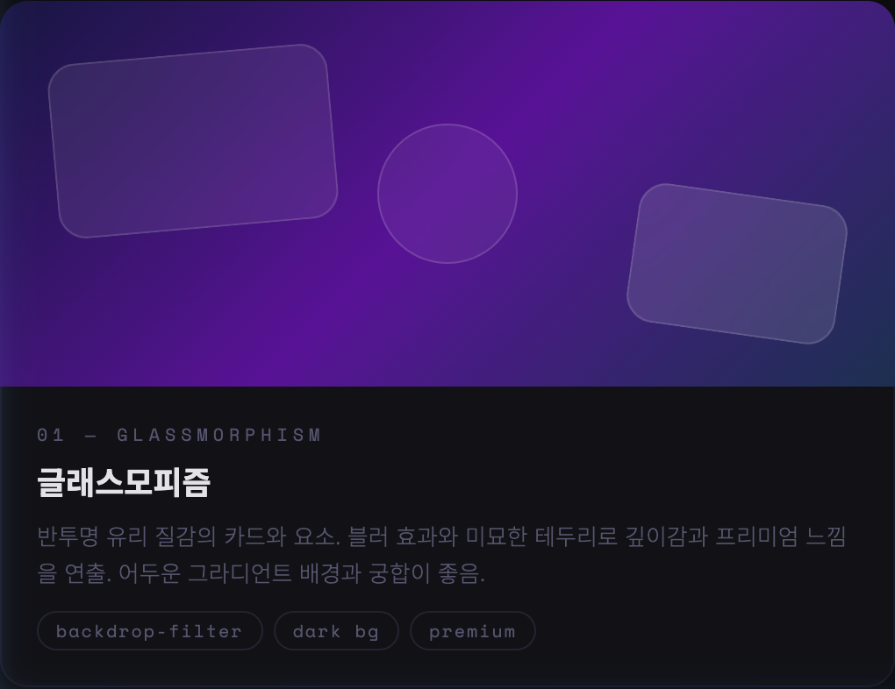
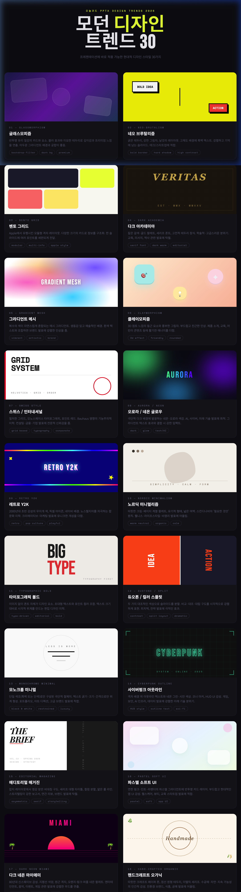

# 🎨 PPTX Modern Design Styles Skill

[English](README.md) | [한국어](README_ko.md) | [디자인 미리보기 🖼️](https://corazzon.github.io/pptx-design-styles/preview/modern-pptx-designs-30.html) | [<span style="color:red">유튜브 영상 가이드</span>](https://youtu.be/5qxrY88lW_Q)

<p align="center">
  <a href="https://youtu.be/5qxrY88lW_Q">
    
  </a>
</p>

> 시각적으로 뛰어난 프레젠테이션을 만들기 위한 Claude.ai 스킬 — 30가지 모던 디자인 스타일 포함

---

## 개요

이 스킬은 Claude.ai가 PPTX 프레젠테이션을 생성할 때 **30가지 엄선된 모던 디자인 스타일**을 적용할 수 있게 해줍니다. 각 스타일에는 정확한 **HEX 색상 값, 폰트 조합, 레이아웃 규칙 및 시그니처 요소**가 포함되어 있어 모든 덱이 특별하게 디자인된 것처럼 보여줍니다.

---

## 🚀 사용 방법

이 섹션에서는 각 AI 플랫폼에서 이 디자인 스킬을 설정하고 사용하는 방법을 안내합니다.

### 1. Claude.ai (Projects)
Claude의 프로젝트 기능을 활용하여 디자인 전문가로 만들 수 있습니다.
- **설치**: 
  1. Claude.ai에서 새로운 **Project**를 생성합니다.
  2. **Project Knowledge**에 `SKILL.md`와 `references/styles.md` 파일을 업로드합니다.
- **사용**: 프로젝트 채팅에서 "PPTX 내용을 구성해줘"라고 요청하면, Claude가 지식 베이스의 스타일 가이드를 바탕으로 30가지 테마 중 최적의 디자인을 적용합니다.

### 2. Gemini Antigravity (Local Skill)
Antigravity 에이전트의 로컬 스킬 시스템에 등록하여 사용합니다.
- **설치**: 
  1. 이 저장소를 로컬의 스킬 디렉토리(`~/.gemini/antigravity/skills/`)로 복사하거나 심볼릭 링크를 생성합니다.
  ```bash
  ln -s $(pwd) ~/.gemini/antigravity/skills/pptx-design-styles
  ```
- **사용**: Antigravity가 자동으로 스킬을 감지하며, "현대적인 느낌의 발표 자료를 만들어줘"와 같은 요청 시 `SKILL.md`의 트리거 조건에 따라 디자인 프로세스가 활성화됩니다.

### 3. Codex (Agent Skill)
Codex 에이전트 환경에서 디자인 가이드라인을 통합합니다.
- **설치**: 
  1. Codex 워크스페이스의 스킬 폴더(`.codex/skills/` 또는 지정된 경로)에 이 프로젝트를 추가합니다.
- **사용**: 에이전트가 코딩 및 문서 작업 중 PPTX 관련 컨텍스트를 감지하면 `SKILL.md`에 정의된 30가지 스타일 규격에 맞춰 슬라이드 구성과 스타일 코드를 생성합니다.

---

## 비주얼 갤러리

이 컬렉션에서 사용할 수 있는 **30가지 고유한 스타일** 중 일부를 살펴보세요.

### ✨ 하이라이트
<p align="center">
  
  
</p>
<p align="center">
  
  
</p>


---

## 30가지 디자인 스타일

| # | 스타일 | 무드 | 추천 용도 |
|---|-------|------|----------|
| 01 | Glassmorphism | 프리미엄 · 테크 | SaaS, AI |
| 02 | Neo-Brutalism | 강렬함 · 스타트업 | 피치 덱 |
| 03 | Bento Grid | 모듈형 · 구조적 | 제품 기능 |
| 04 | Dark Academia | 학술적 · 세련됨 | 교육, 연구 |
| 05 | Gradient Mesh | 예술적 · 생동감 | 브랜드 런칭 |
| 06 | Claymorphism | 친근함 · 3D | 앱, 교육 |
| 07 | Swiss International | 기능적 · 기업용 | 컨설팅, 금융 |
| 08 | Aurora Neon Glow | 미래지향적 · AI | AI, 사이버보안 |
| 09 | Retro Y2K | 향수 · 팝 | 행사, 마케팅 |
| 10 | Nordic Minimalism | 차분함 · 자연 | 웰니스, 비영리 |
| 11 | Typographic Bold | 에디토리얼 · 임팩트 | 브랜드 선언 |
| 12 | Duotone Color Split | 드라마틱 · 대비 | 전략 덱 |
| 13 | Monochrome Minimal | 절제미 · 럭셔리 | 럭셔리 브랜드 |
| 14 | Cyberpunk Outline | HUD · 공상과학 | 게임, 인프라 |
| 15 | Editorial Magazine | 매거진 · 스토리 | 연간 리뷰 |
| 16 | Pastel Soft UI | 부드러움 · 앱 스타일 | 헬스케어, 뷰티 |
| 17 | Dark Neon Miami | 신스웨이브 · 80년대 | 엔터테인먼트 |
| 18 | Hand-crafted Organic | 자연주의 · 에코 | 친환경 브랜드 |
| 19 | Isometric 3D Flat | 기술적 · 구조적 | IT 아키텍처 |
| 20 | Vaporwave | 몽환적 · 서브컬처 | 크리에이티브 에이전시 |
| 21 | Art Deco Luxe | 골드 · 기하학적 | 럭셔리, 갈라 행사 |
| 22 | Brutalist Newspaper | 에디토리얼 · 로우 | 미디어, 연구 |
| 23 | Stained Glass Mosaic | 화려함 · 예술적 | 문화, 박물관 |
| 24 | Liquid Blob Morphing | 유동적 · 오가닉 테크 | 바이오테크, 혁신 |
| 25 | Memphis Pop Pattern | 80년대 · 기하학적 | 패션, 라이프스타일 |
| 26 | Dark Forest Nature | 신비로움 · 분위기 있는 | 친환경 프리미엄 |
| 27 | Architectural Blueprint | 기술적 · 정밀함 | 건축 |
| 28 | Maximalist Collage | 에너제틱 · 레이어드 | 광고, 패션 |
| 29 | SciFi Holographic Data | 홀로그램 · HUD | AI, 양자컴퓨팅 |
| 30 | Risograph Print | CMYK · 인디 | 출판, 예술 |

---

## 파일 구조

```
pptx-design-styles/
├── SKILL.md              # 스킬 트리거 + 추천 매트릭스
├── README.md             # 영문 안내서
├── README_ko.md          # 한국어 안내서
├── preview/
│   └── modern-pptx-designs-30.html
└── references/
    └── styles.md         # 전체 사양: HEX 색상, 폰트, 레이아웃, 시그니처 요소
```

---

## 스타일 선택 가이드

| 목적 | 추천 스타일 |
|------|-------------|
| 테크 / AI / 스타트업 | Glassmorphism, Aurora Neon, Cyberpunk, SciFi Holographic |
| 기업 / 금융 | Swiss International, Monochrome, Editorial Magazine |
| 브랜드 / 마케팅 | Gradient Mesh, Typographic Bold, Duotone Split |
| 제품 / 앱 / UX | Bento Grid, Claymorphism, Pastel Soft UI |
| 엔터테인먼트 / 게임 | Retro Y2K, Dark Neon Miami, Vaporwave, Memphis Pop |
| 에코 / 웰니스 | Hand-crafted Organic, Nordic Minimalism, Dark Forest |
| 럭셔리 / 프리미엄 | Art Deco Luxe, Monochrome Minimal, Dark Academia |
| 과학 / 바이오테크 | Liquid Blob, SciFi Holographic, Aurora Neon |

---

### 📱 전체 컬렉션 미리보기
<p align="center">
  
</p>

---

## 만든이

**TodayCode (오늘코드)** — [YouTube](https://youtube.com/@todaycode) · 한국어 Python 및 AI 교육

---

## 라이선스

MIT 라이선스 — 자유로운 사용, 수정 및 배포가 가능합니다.
