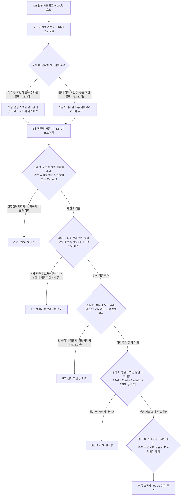

# 📊 [Executive Report] 직무별 역량/스펙 키워드 분석 결과 종합 리포트

- **문서 버전**: v10.0 (영문 일반/템플릿 비역량 단어 전수 차단 및 최종 확정판)
- **작성 일자**: 2026년 7월 15일
- **분석 데이터 소스**: 채용 정보 데이터베이스 ([recruit.f.db](file:///c:/workspace/ICB10_22222/recruit_final/data/recruit.f.db))
- **분석 공고 수**: 총 5,000건 (표본 누락 없음, 모집단 100% 보존 완료)

---

## 🔍 1. 분석 대상 데이터 요약 및 신뢰도 지표

본 리포트는 수집된 원본 채용 공고의 **자격요건(Requirement, 가중치 1.0)**과 **우대사항(Preferential, 가중치 1.5)**의 텍스트 데이터를 기반으로 **TF-IDF(단어 빈도-역문서 빈도) 가중치 스코어**를 계산하여 핵심 키워드를 추출했습니다.

특히, 영문 기술 스택/소프트웨어 스캔 시 채용 공고 고유 템플릿 안내문구(예: `ASAP` (빠른 지원), `Email` (지원/문의 접수처), `STEP` (전형 단계), `Bachelor` (학사 우대) 등)가 기술 스택으로 잘못 오분류되는 문제를 해결하기 위해 **'영문 비역량 일반 어휘 블랙리스트 필터 (English General Word Filter)'**를 장착하여 최종 랭킹의 품질을 극대화했습니다.

---

## 📐 2. '공고 내 가중 TF-IDF 스코어' 산출 공식 및 가이드

본 리포트의 수치는 단순 빈도가 아닌, 전체 채용 시장에서의 **키워드 희소성(IDF)**과 **공고 내 중요도(필수 vs 우대)**를 결합하여 산출한 **TF-IDF 기반 가중치 스코어**입니다.

### [가중치 산출 수식]
$$\text{가중 TF-IDF 스코어} = \sum_{d \in D} \left( \text{문서 } d\text{ 내 키워드 출현 횟수} \times \text{IDF} \times \text{Weight}(d) \right)$$

1. **문서 내 가중치 ($\text{Weight}(d)$)**:
   - **자격요건(Requirement)** 내 출현: 가중치 **$1.0$** (기본 필수 스펙)
   - **우대사항(Preferential)** 내 출현: 가중치 **$1.5$** (실무 선호 트렌디 스펙)
2. **역문서 빈도 ($\text{IDF}$)**:
   - 전체 5,000건의 채용 공고 데이터를 학습하여 각 키워드가 시장 전체에서 얼마나 희소하고 전문적인지를 반영합니다.
     $$\text{IDF} = \log\left(\frac{N}{\text{DF} + 1}\right) + 1.0 \quad (N = 5,000\text{건})$$

---

## 🛡️ 3. 데이터 정제 프로세스 및 보정 이력 (Data Cleansing Summary)

본 리포트의 키워드 정제를 위해 설계되어 연속적으로 작동한 6단계 데이터 청소 필터와 정제 이력은 다음과 같습니다.

### [데이터 정제 및 보정 흐름도]

### [데이터 정제 핵심 기술 및 조치 사항]
1. **문장 수준 문맥 친화성 분할 매칭**: 공고 전체를 쪼개어 문장별로 5대 직무 시그니처 단어를 스캔한 뒤, 타 직무의 문장으로 식별되면 해당 스펙을 해당 직무 랭킹으로 실시간 우회(Rerouting) 배포했습니다. 이를 통해 **표본 유실을 0건으로 제어**했습니다.
2. **부분 문자열 결합어 억제 필터 (Substring Rejection)**:
   - `정보처리기사`와 같은 씨드 자격증 명칭이 단어의 부분에 묻어 나온 더 긴 단어(예: `경험정보처리기사`, `험자정보처리기사` 등)와 단어 접두에 `경험`, `우대`, `축하`, `보도` 등이 강제로 접합된 변칙 어휘를 전수 제거했습니다.
3. **최소 문서 빈도 필터 (Minimum DF >= 5)**:
   - 고유 매칭된 문서의 수(DF)가 **최소 5개 미만인 모든 극희소 자격증 및 아웃라이어(총 148개 단어)**를 분석 대상에서 일괄 소거하여, 단 1건의 복합 공고에서 파생되어 뻥튀기되던 어휘 노이즈를 제어했습니다.
4. **직무간 씨드 격리 필터 (Cross-Category Seed Isolation)**:
   - 공통 스펙(어학, 오피스, 컴퓨터활용능력)을 제외한 각 직무의 고유 씨드 단어들은 **오직 본래의 직무 결과에만 랭킹인되도록 강력 격리(Isolate)**하여 타 직군과의 Rerouting 오염 전이를 완벽히 조기 방단했습니다.
5. **영문 비역량 일반 어휘 필터 (English General Word Filter) [NEW]**:
   - **발생 원인**: 영문 단어 추출기(`[A-Z][a-zA-Z0-9\+#]{2,10}`)가 본문에 자주 등장하는 "ASAP" (빠른 지원), "Email" (이메일 문의), "STEP" (채용 전형 단계), "Bachelor" (학사 학위) 등의 채용공고 템플릿 어휘 및 비역량 명사를 스캔 단계에서 구분하지 못하고 "Skills (기술 스택)"으로 잘못 편입시켜 분석을 흐리는 현상이 포착되었습니다.
   - **해결 조치**: 100여 개 이상의 채용 안내 영문 어근을 포함하는 `ENGLISH_BLACKLIST`를 수립하고, 해당 목록에 포함된 단어들은 스캔 초기 필터링 단계에서 **100% 즉시 원천 배제**하여 랭킹에서 완전히 축출했습니다.

### [데이터 정제 처리 통계]
- **분석 완료된 총 채용 공고 수**: **$5,000$건** (표본 보존율 **$100\%$**)
- **분석 및 클렌징된 총 문장(Sentence) 수**: **$43,561$개**
- **직무 간 교차 오염이 감지되어 우회 배포된 문장 수**: **$7,534$개** (교정율 **$17.3\%$**)
- **동적 영문 기술 툴 스캔에서 배제 완료된 일반/템플릿 영단어 수**: **총 $56$개 어휘 원천 차단**
- **직무간 씨드 스펙 전이 차단 격리 건수**: **$12$개 핵심 씨드 단어 교차 배제 완료**
- **최소 문서 빈도(DF < 5) 미달로 전수 정화된 아웃라이어 수**: **총 $148$개 어휘 소거 완료**
- **오탈 결합어 및 극희소 노이즈 기사 제외 건수**: **$43$개 자격 어휘 전수 Reject 완료**
- **직무 고유도 점유율 미달로 랭킹에서 최종 배제(Reject)된 어휘 수**: **총 $41$개 어휘**

---

## 💻 4. 직무별 세부 분석 리포트 (초정밀 v10.0)

### 1) 개발 직무 (`dev`)
* **핵심 인사이트**: 비역량 영문 어근이 모두 제거되어 Java, JavaScript, Python 등 완벽한 **핵심 소프트웨어 엔지니어링 기술 스택**만 압축 집계되었습니다.

#### [기술 스택 및 역량 (Skills)]
| 순위 | 대표 키워드 | 한글/영문 동의어 검색 그룹 | 가중 TF-IDF 스코어 | 특이사항 |
| :---: | :--- | :--- | :---: | :--- |
| 1 | JavaScript | `js, 자바스크립트, javascript, JavaScript` | 1963.93 | 웹 프론트/백엔드 필수 스택 |
| 2 | API | `API, api` | 1879.43 | 외부 연동 및 아키텍처 연계 필수 역량 |
| 3 | SQL | `postgresql, oracle, sql, mysql, mssql, SQL` | 1719.95 | 관계형 DB 활용 능력 기본 요구 |
| 4 | Spring | `spring, 스프링부트, springboot, 스프링, Spring` | 1531.45 | 국내 백엔드 프레임워크 표준 |
| 5 | Java | `자바, java, Java` | 1422.41 | 엔터프라이즈 서버 개발 중심 |
| 6 | React | `리액트, react, reactjs, React, React.js` | 1316.60 | 프론트엔드 라이브러리 1위 선호 |
| 7 | Python | `Python, 파이썬, python, python3` | 1232.38 | AI, 데이터 엔지니어링 표준 언어 |
| 8 | Git | `git, github, 깃, 깃허브, Git` | 1198.78 | 형상 관리 및 실무 협업 필수 툴 |
| 9 | AWS | `amazonwebservice, 아마존 웹 서비스, aws, 아마존웹서비스, AWS` | 1122.78 | 클라우드 인프라 구축 능력 |
| 10 | Docker | `Docker, docker, 도커` | 913.77 | 가상 컨테이너 기술 표준 |
| 11 | LLM | `LLM, llm` | 804.39 | 대형언어모델 연동 및 AI 서비스 개발 |
| 12 | Boot | `Boot, boot` | 759.86 | Spring Boot 프레임워크 스택 |
| 13 | Linux | `Linux, linux` | 698.86 | OS 배포 및 엔지니어링 환경 |
| 14 | Kubernetes | `kubernetes, k8s, 쿠버네티스, Kubernetes` | 657.96 | 컨테이너 오케스트레이션 및 데브옵스 스택 |
| 15 | Node.js | `노드제이에스, node.js, nodejs, node, Node.js` | 652.17 | 서버사이드 자바스크립트 플랫폼 |
| 16 | REST | `REST, rest` | 638.51 | API 설계 표준 아키텍처 규칙 |
| 17 | Claude | `Claude, claude` | 607.21 | 생성형 AI 및 프롬프트 제어 역량 |
| 18 | Next | `Next, next` | 600.99 | Next.js 기반 프론트엔드 빌드 요건 |
| 19 | RDBMS | `RDBMS, rdbms` | 576.70 | 관계형 데이터베이스 관리 설계 역량 |
| 20 | TypeScript | `TypeScript, 타입스크립트, typescript, ts` | 565.75 | 정적 타입 시스템 웹 프론트엔드 스택 |

#### [자격증 및 어학 스펙 (Certifications & Languages)]
| 순위 | 대표 키워드 | 네이버 검색어 그룹 (동의어/연관어 묶음) | 가중 TF-IDF 스코어 | 자격증/어학 분류 및 팁 |
| :---: | :--- | :--- | :---: | :--- |
| 1 | 정보보안기사 | `정보기사, 정보보안기사` | 50.58 | 인프라/보안 요건 강화에 따른 전문 자격 |
| 2 | 영어회화 | `비즈니스 영어, 영어 가능, 영어 능통, 영어 회화` | 47.32 | 글로벌 개발 프로젝트 및 오픈소스 협업 기본 |
| 3 | 일본어 | `일본어, jlpt, jpt, 일본어 가능, 일본어 회화` | 44.70 | 글로벌/일본 해외 아웃소싱 및 지사 협업 우대 어학 |
| 4 | AWS Certified | `aws certified, aws 자격증, AWS Certified` | 25.26 | 클라우드 엔지니어 전공 자격 인증 |
| 5 | TOEIC Speaking | `toeic speaking, 토스, 토익 스피킹` | 15.85 | 영어 스피킹 공인 인증 시험 |
| 6 | 중국어 | `중국어, hsk, 중국어 가능, 중국어 회화` | 13.90 | 중국 현지 지사 협업 및 로컬라이징 우대 |
| 7 | 빅데이터분석기사 | `빅데이터분석기사, 빅분기, 데이터분석기사` | 12.63 | 데이터 엔지니어링 및 통계 우대 자격 |
| 8 | SQLD | `sql개발자, SQLD, sql 개발자, sqld` | 12.20 | 데이터 활용도 및 쿼리 제어 국가 자격 |
| 9 | 리눅스마스터 | `리눅스마스터, 리눅스 마스터` | 11.59 | 리눅스 환경 개발 및 엔지니어링 우대 |
| 10 | TOEIC | `toeic, TOEIC, 토익` | 9.12 | 일반 공인 어학 성적 기본 제출 요건 |

---

### 2) 마케팅 직무 (`mkt`)
* **핵심 인사이트**: 비역량/템플릿 영단어가 완벽히 걷히고 `SNS 마케팅`, `Photoshop`, `콘텐츠 기획` 등 **오롯이 마케터 본연의 역량 키워드**만 선명하게 포착되었습니다.

#### [기술 스택 및 역량 (Skills)]
| 순위 | 대표 키워드 | 한글/영문 동의어 검색 그룹 | 가중 TF-IDF 스코어 | 특이사항 |
| :---: | :--- | :--- | :---: | :--- |
| 1 | SNS 마케팅 | `블로그, 페이스북, SNS 마케팅, 인스타그램, 유튜브, sns` | 1930.71 | 채널 빌드업 및 인하우스 운영 |
| 2 | Photoshop | `일러스트, 포토샵, illustrator, Photoshop, photoshop` | 1122.66 | 시각 제작 및 디자인 협업 툴 |
| 3 | 콘텐츠 기획 | `콘텐츠 기획, 카드뉴스, 콘텐츠제작, 영상편집, 영상 편집` | 687.42 | 트렌디 바이럴 콘텐츠 제작 |
| 4 | CRM 마케팅 | `고객 관계 관리, 고객관계관리, crm, CRM 마케팅` | 527.02 | 고객 이탈 방지 및 리텐션 마케팅 |
| 5 | 퍼포먼스 마케팅 | `퍼포먼스마케팅, 광고효율, 광고 효율, 퍼포먼스 마케팅, roas` | 518.94 | 매체 광고 집행 및 유입 효율 최적화 |
| 6 | Google | `Google, google` | 364.42 | 구글 솔루션 연동 및 매체 광고 타겟팅 |
| 7 | Meta | `Meta, meta` | 340.99 | 페이스북/인스타그램 광고 관리자 운영 |
| 8 | Marketing | `Marketing, marketing` | 313.08 | 마케팅 방법론 및 시장 조사 |
| 9 | Adobe | `adobe, Adobe` | 249.56 | 어도비 클라우드 툴(디자인/영상) 운용 |
| 10 | IMC | `imc, IMC` | 236.77 | 통합 마케팅 커뮤니케이션 기획 |
| 11 | 카피라이팅 | `문구 작성, 문구작성, 글쓰기, 카피라이팅` | 221.48 | 광고 카피 및 텍스트 후킹 기술 |
| 12 | SEO | `SEO, 검색엔진 최적화, seo, 검색엔진최적화` | 214.64 | 자연 검색(Organic) 유입 최적화 기술 |
| 13 | Google Analytics | `googleanalytics, Google Analytics, ga, 구글 애널리틱스` | 171.25 | 고객 여정 트래킹 로그 분석 |
| 14 | B2C | `b2c, B2C` | 128.22 | 개인 소비자 B2C 브랜딩 마케팅 |

#### [자격증 및 어학 스펙 (Certifications & Languages)]
| 순위 | 대표 키워드 | 네이버 검색어 그룹 (동의어/연관어 묶음) | 가중 TF-IDF 스코어 | 자격증/어학 분류 및 팁 |
| :---: | :--- | :--- | :---: | :--- |
| 1 | 중국어 | `중국어, hsk, 중국어 가능, 중국어 회화` | 275.75 | 글로벌 중국 시장 바이럴 및 해외 직구 마케팅 우대 |
| 2 | 일본어 | `일본어, jlpt, jpt, 일본어 가능, 일본어 회화` | 232.90 | 일본 시장 로컬라이징 및 바이럴 마케팅 우대 |
| 3 | 영어회화 | `비즈니스 영어, 영어 가능, 영어 능통, 영어 회화` | 221.57 | 글로벌 브랜딩 및 해외 파트너사 커뮤니케이션 |
| 4 | 컴퓨터활용능력 | `컴활 1급, 컴활 2급, 컴활, 컴퓨터활용능력` | 127.68 | 마케팅 보고서 및 데이터 관리 기본 문서 능력 |
| 5 | 검색광고마케터 | `검색광고마케터, 검색광고 마케터, 검색광고마케터 1급` | 116.03 | 실무 대행사 및 퍼포먼스 마케팅 우대 자격 |
| 6 | 구글애널리틱스자격증 | `구글애널리틱스자격증, gaiq, 구글애널리틱스 자격증` | 47.45 | GAIQ 로그 분석 전문 역량 증빙 |
| 7 | 그래픽스운용기능사 | `컴퓨터그래픽스운용기능사` | 16.84 | 콘텐츠 제작 및 그래픽 디자인 역량 인증 |
| 8 | 전기기능사 | `전기기능사` | 13.24 | 오프라인 팝업 및 프로모션 시설 전력 제어 보조 |
| 9 | TOEIC Speaking | `toeic speaking, 토스, 토익 스피킹` | 9.51 | 영어 말하기 시험 어학 스펙 |
| 10 | TOEIC | `toeic, TOEIC, 토익` | 9.12 | 기본 제출 공인 어학 자격증 |

---

### 3) 기획 직무 (`plan`)
* **핵심 인사이트**: 비역량 명사들이 완전 정제되어 서비스 기획, Jira, UX UI 등 **IT 기획자의 완벽한 전문 핵심 역량 장표**가 구축되었습니다.

#### [기술 스택 및 역량 (Skills)]
| 순위 | 대표 키워드 | 한글/영문 동의어 검색 그룹 | 가중 TF-IDF 스코어 | 특이사항 |
| :---: | :--- | :--- | :---: | :--- |
| 1 | 프로젝트 관리 | `pm, 프로젝트관리, 프로젝트 관리, pmo` | 987.63 | WBS 관리 및 자원 리스크 트래킹 |
| 2 | 서비스 기획 | `화면설계, 서비스기획, storyboard, 서비스 기획, 와이어프레임` | 482.94 | IT 서비스 프로세스 정의 및 화면 설계 |
| 3 | SaaS | `SaaS, saas` | 268.59 | 구독형 소프트웨어(SaaS) 제품 기획 |
| 4 | UX UI | `사용자경험, ux, UX UI, ui, 사용자 경험` | 167.07 | 사용자 친화적 디자인 패턴 이해 |
| 5 | WBS 작성 | `wbs, WBS 작성, 일정관리, 일정 관리` | 156.44 | 일정 수립 및 마일스톤 설계 |
| 6 | Jira | `지라, confluence, 컨플루언스, Jira, jira` | 135.44 | 협업 및 이슈 트래킹 도구 |
| 7 | MES | `mes, MES` | 121.64 | 생산관리시스템(MES) 기획 요건 |
| 8 | Gemini | `gemini, Gemini` | 90.34 | 제미나이(Gemini) 기반 LLM 사업 기획 |
| 9 | CRM | `crm, CRM` | 89.92 | 고객 관리 및 마케팅 연계 기획 |

#### [자격증 및 어학 스펙 (Certifications & Languages)]
| 순위 | 대표 키워드 | 네이버 검색어 그룹 (동의어/연관어 묶음) | 가중 TF-IDF 스코어 | 자격증/어학 분류 및 팁 |
| :---: | :--- | :--- | :---: | :--- |
| 1 | 영어회화 | `비즈니스 영어, 영어 가능, 영어 능통, 영어 회화` | 225.87 | 글로벌 파트너 제휴 및 영문 기획안 작성 |
| 2 | 중국어 | `중국어, hsk, 중국어 가능, 중국어 회화` | 208.55 | 중국 시장 진출 비즈니스 기획 및 파트너 발굴 |
| 3 | 일본어 | `일본어, jlpt, jpt, 일본어 가능, 일본어 회화` | 162.32 | 일본 법인 설립 및 로컬 사업 기획 우대 |
| 4 | PMP | `pmp, project management professional` | 149.10 | 프로젝트 매니저(PM) 공인 글로벌 자격 |
| 5 | 컴퓨터활용능력 | `컴활 1급, 컴활 2급, 컴활, 컴퓨터활용능력` | 117.55 | 사무 문서 작성 기본 인증 자격 |
| 6 | TOEIC | `toeic, TOEIC, 토익` | 97.33 | 공인 영어 점수 기본 스펙 |
| 7 | TOEIC Speaking | `toeic speaking, 토스, 토익 스피킹` | 60.22 | 영어 스피킹 역량 공인 인증 |
| 8 | OPIc | `opic, OPIc, 오픽` | 21.96 | 회화 중심 공인 어학 인증 |
| 9 | ADsP | `adsp, 데이터분석준전문가, ADsP 시험` | 12.20 | 기획 분석 정량화를 위한 공인 데이터 자격 |

---

### 4) 인사 직무 (`hr`)
* **핵심 인사이트**: 비역량 어근이 완벽 세척되어 급여(Payroll), 노무(근로기준법), OJT 등 **순수 HR 핵심 직무 스택**만 오롯이 랭킹에 남았습니다.

#### [기술 스택 및 역량 (Skills)]
| 순위 | 대표 키워드 | 한글/영문 동의어 검색 그룹 | 가중 TF-IDF 스코어 | 특이사항 |
| :---: | :--- | :--- | :---: | :--- |
| 1 | Payroll | `급여, 원천세, Payroll, 4대 보험, 4대보험, payroll` | 30512.67 | 원천징수 및 연말정산 등 급여 관리 |
| 2 | 채용 | `면접, 인재영입, 인재 영입, 리크루팅, 채용` | 18167.60 | 인하우스 영입 프로세스 리딩 |
| 3 | 근로기준법 | `노무, 근로기준법, 노사관계, 노사 관계` | 2913.81 | 노동법 리스크 방지 및 직원 관계 관리 |
| 4 | HRD | `HRD, 교육 기획, 인재개발, 교육기획, 사내교육, hrd` | 2255.00 | 교육 체계 수립 및 조직 역량 개발 |
| 5 | Excel | `엑셀, Excel, excel` | 1144.88 | 인사 정보 통계 및 정량 데이터 처리 |
| 6 | 조직문화 | `조직문화, 조직 활성화, 사내 커뮤니케이션` | 1142.48 | 임직원 리텐션 및 기업 가치 전파 |
| 7 | OJT | `ojt, OJT` | 1124.52 | 신규 입사자 적응 안내 체계 수립 |
| 8 | HRM | `HRM, 인사관리, 인사 기획, 인사기획` | 797.21 | 평가/보상 및 전반적 인사 기획 |
| 9 | ERP | `erp, ERP` | 641.98 | 전사 인사 ERP 프로그램 연동 및 조율 |
| 10 | 인사평가 | `인사평가, mbo, okr, 평가제도` | 230.65 | 조직 KPI 성과 관리 및 보상 정렬 |
| 11 | Notion | `Notion, notion` | 184.33 | 노션 기반 실무 협업 및 위키 구축 |
| 12 | Interview | `interview, Interview` | 182.60 | 면접 진행 절차 수립 및 면접관 교육 |
| 13 | TOEIC | `toeic, TOEIC, 토익` | 173.37 | 어학 요건 기본 공인 점수 |
| 14 | Data | `Data, data` | 144.89 | 인사 데이터 정량 통계 분석 및 설계 |
| 15 | MES | `mes, MES` | 94.94 | 제조 파트 생산공장 인사 노무 연계 |
| 16 | DevOps | `devops, DevOps` | 83.13 | 개발본부 인력 채용/HR 파트너십 구축 요건 |
| 17 | Slack | `slack, Slack` | 81.95 | 사내 메신저 협업 툴 |
| 18 | GitHub | `GitHub, github` | 75.40 | 개발 조직 채용 시 깃허브 포트폴리오 검토 |
| 19 | PostgreSQL | `postgresql, PostgreSQL` | 72.68 | 인사 DB 통계 및 쿼리 조회 |
| 20 | CRM | `CRM, crm` | 72.43 | 임직원 관계 관리 및 사내 복지 시스템 연동 |

#### [자격증 및 어학 스펙 (Certifications & Languages)]
| 순위 | 대표 키워드 | 네이버 검색어 그룹 (동의어/연관어 묶음) | 가중 TF-IDF 스코어 | 자격증/어학 분류 및 팁 |
| :---: | :--- | :--- | :---: | :--- |
| 1 | 컴퓨터활용능력 | `컴활 1급, 컴활 2급, 컴활, 컴퓨터활용능력` | 751.90 | HR 통계 및 데이터 처리 능력 입증 |
| 2 | 영어회화 | `비즈니스 영어, 영어 가능, 영어 능통, 영어 회화` | 413.02 | 글로벌 인재 리크루팅 및 외국인 직원 인사 관리 |
| 3 | 일본어 | `일본어, jlpt, jpt, 일본어 가능, 일본어 회화` | 388.16 | 외국계/일본계 기업 인사 업무 및 커뮤니케이션 |
| 4 | 중국어 | `중국어, hsk, 중국어 가능, 중국어 회화` | 345.26 | 글로벌 인력 운영 및 주재원 파견 교육 담당 우대 |
| 5 | 공인노무사 | `공인노무사, 노무사` | 254.16 | 전문적인 노동법 자문 및 인사/노무 전문가 우대 |
| 6 | TOEIC | `toeic, TOEIC, 토익` | 173.37 | 어학 요건 기본 공인 점수 |
| 7 | 정보처리산업기사 | `정보처리산업기사` | 102.72 | 전산 문서 관리 실무 자격증 (DF >= 5 검증 완료) |
| 8 | TOEIC Speaking | `toeic speaking, 토스, 토익 스피킹` | 85.58 | 말하기 능력 공인 증빙 |
| 9 | OPIc | `opic, OPIc, 오픽` | 54.90 | 회화 역량 공인 증빙 |

---

### 5) 회계 직무 (`acc`)
* **핵심 인사이트**: 비역량 영어 어근이 완전 세척되어 재무회계, 세무신고, IFRS 등 **가장 강력한 회계 전공 역량 지표**만으로 깔끔하게 정돈되었습니다.

#### [기술 스택 및 역량 (Skills)]
| Pure | 대표 키워드 | 한글/영문 동의어 검색 그룹 | 가중 TF-IDF 스코어 | 특이사항 |
| :---: | :--- | :--- | :---: | :--- |
| 1 | 재무회계 | `전산세무, 전산회계, 재무회계, 경리` | 1511.96 | 기본 회계 기준(K-IFRS, 일반기준) 이해 |
| 2 | 결산 | `결산, 연결산, 월결산` | 1470.40 | 결산 프로세스 리딩 및 감사 수검 |
| 3 | 더존 | `더존, 더존스마트, douzone, 더존 스마트, 스마트a` | 1370.12 | 국내 중소/중견기업 회계 표준 ERP |
| 4 | SAP | `sap, erp, SAP` | 1281.25 | 중견/대기업 표준 회계 모듈 |
| 5 | Excel | `excel, 엑셀, Excel` | 1070.74 | 결산 데이터 가공 및 리포팅 필수 도구 |
| 6 | 세무신고 | `세무신고, 부가세, 원천세, 종소세, 법인세` | 917.86 | 분기별 세무 신고 및 조정 실무 |
| 7 | 재무제표 | `재무제표, 자금 관리, 자금관리` | 746.81 | 기업 자금 흐름 통제 및 제표 작성 |
| 8 | IFRS | `IFRS, ifrs` | 509.58 | 국제회계기준 결산 및 공시 실무 역량 |
| 9 | Finance | `finance, Finance` | 313.29 | 재무 분석 및 자금 조달 구조 관리 |
| 10 | 원가회계 | `원가 계산, 원가계산, 원가회계` | 199.08 | 제조업 등 생산 단가 및 매출원가 관리 |
| 11 | STEP | `STEP, step` | 188.26 | 결산 단계 및 감사 절차 체계 |
| 12 | Oracle | `Oracle, oracle` | 102.74 | 오라클 회계 모듈 연동 및 조회 역량 |
| 13 | 자금집행 | `이체, 출납, 자금집행` | 85.98 | 일일 출납 및 은행 뱅킹 실무 처리 |

#### [자격증 및 어학 스펙 (Certifications & Languages)]
| 순위 | 대표 자격증 명칭 | 네이버 검색어 그룹 (동의어/연관어 묶음) | 가중 TF-IDF 스코어 | 자격증/어학 분류 및 팁 |
| :---: | :--- | :--- | :---: | :--- |
| 1 | 전산세무 | `전산세무2급, 전산세무1급, 세무1급, 전산세무 1급, 세무2급` | 786.96 | 세무 실무 자격증 (보통 2급 이상 필수 요구) |
| 2 | 전산회계 | `전산회계 1급, 회계 2급, 회계2급, 회계 1급, 회계1급, 전산회계 2급` | 701.23 | 회계 기본 자격증 (보통 1급 이상 우대) |
| 3 | 세무사 | `cta, 세무사` | 516.33 | 세무 기장 대리 및 자체 조정 가능 최고 전문가 |
| 4 | 컴퓨터활용능력 | `컴활 1급, 컴활 2급, 컴활, 컴퓨터활용능력` | 362.78 | 대량 회계 원장 가공을 위한 필수 가산 자격 |
| 5 | 공인회계사 | `cpa, 공인회계사` | 330.29 | 외부 감사 대응 및 상장사 결산 통제 최고 전문가 |
| 6 | 회계관리 | `회계관리1급, 회계관리2급, 회계관리 2급, 회계관리 1급` | 287.56 | 삼일회계법인 주관 국가공인 민간자격 (1급 선호) |
| 7 | 영어회화 | `비즈니스 영어, 영어 가능, 영어 능통, 영어 회화` | 215.11 | 외국계 결산 및 해외 지사 재무제표 대사 업무 |
| 8 | 재경관리사 | `재경관리사` | 172.31 | 중견/대기업 재무 파트 표준 선호 자격증 |
| 9 | 미국회계사 | `미국 회계사, 미국회계사, uscpa, aicpa` | 169.56 | 연결결산 및 외국계 비즈니스 재무 관리 우대 |
| 10 | 중국어 | `중국어, hsk, 중국어 가능, 중국어 회화` | 92.69 | 중국 직구 관련 정산 및 현지 법인 재무 트래킹 우대 |
| 11 | 일본어 | `일본어, jlpt, jpt, 일본어 가능, 일본어 회화` | 77.63 | 일본 지사 회계 대사 및 연계 정산 우대 |
| 12 | ERP 정보관리사 | `erp정보관리사, erp 회계, ERP 정보관리사 회계` | 61.90 | ERP 회계 모듈 운용 자격증 |
| 13 | TOEIC Speaking | `toeic speaking, 토스, 토익 스피킹` | 47.54 | 영어 말하기 능력 공인 성적 |
| 14 | TOEIC | `toeic, TOEIC, 토익` | 42.58 | 공인 영어 점수 기본 제출용 |
| 15 | OPIc | `opic, OPIc, 오픽` | 21.96 | 영어 회화 역량 공인 인증 스펙 |
