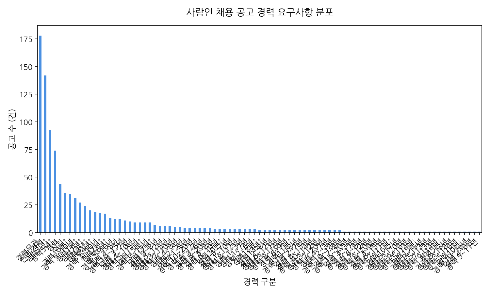
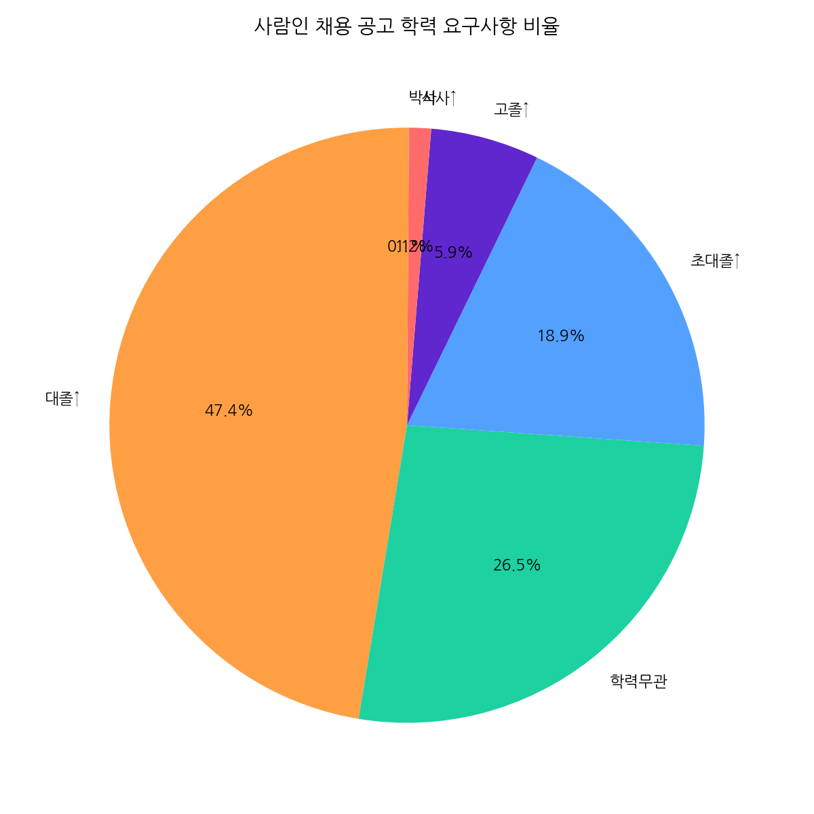
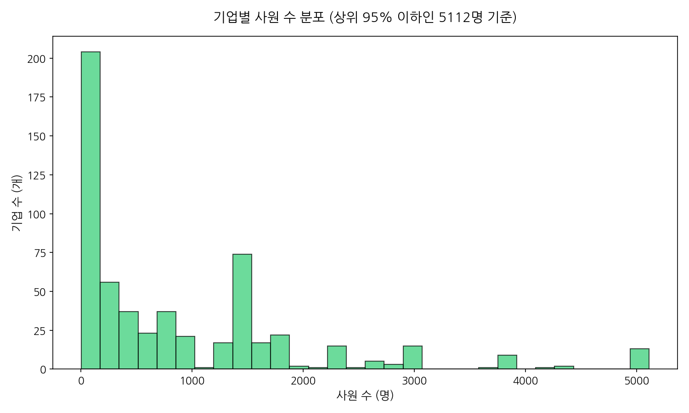
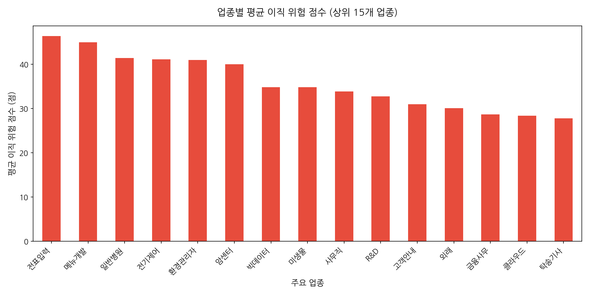
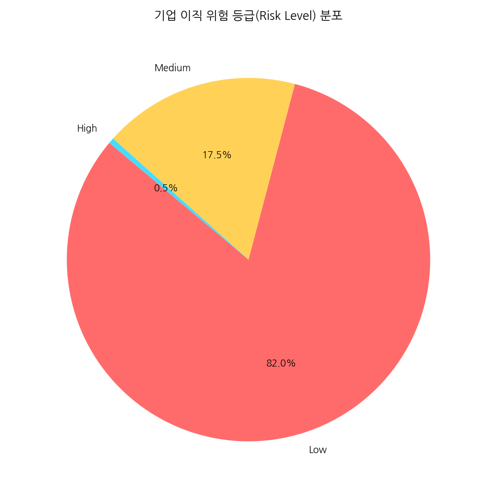
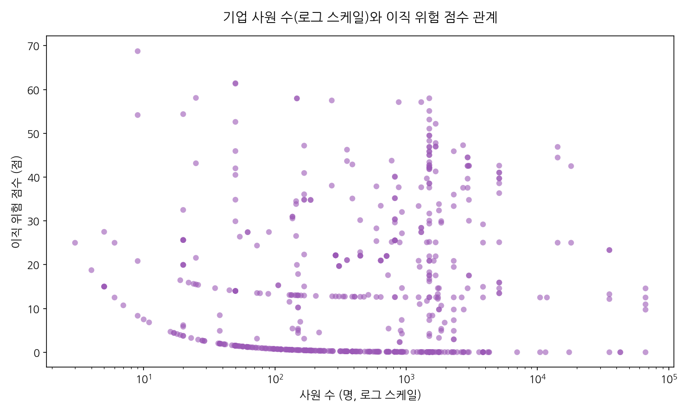
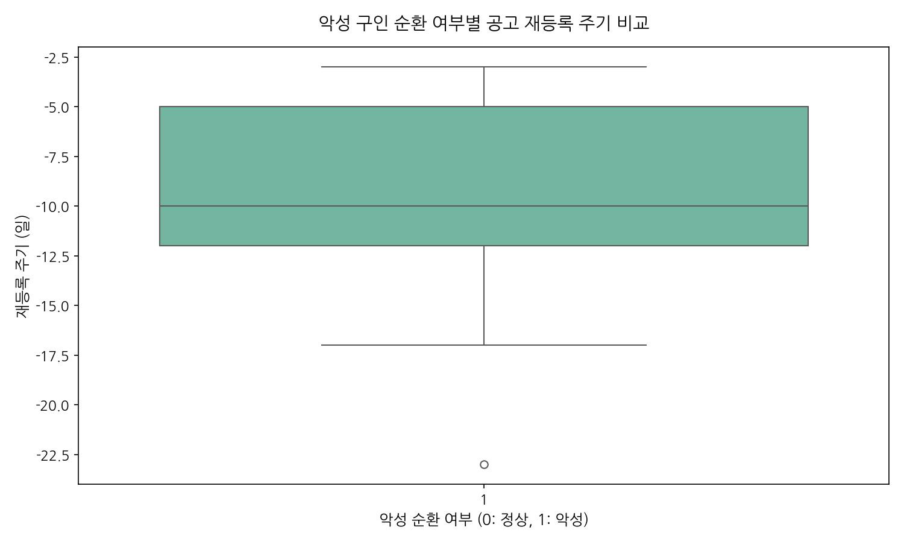
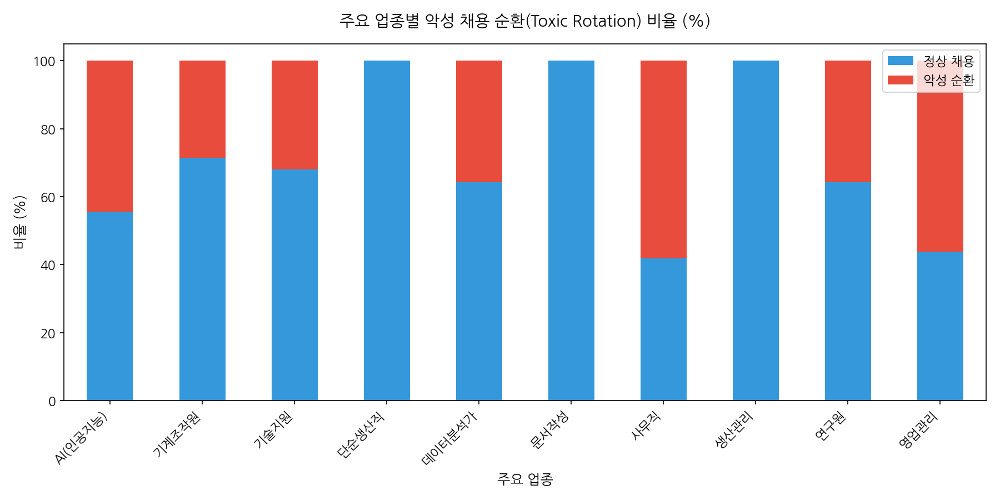
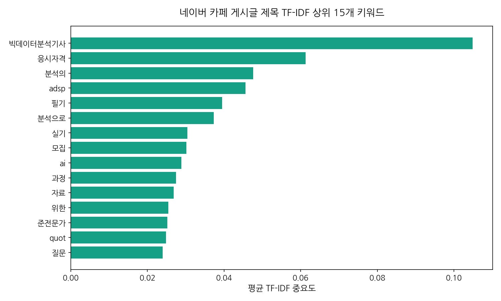
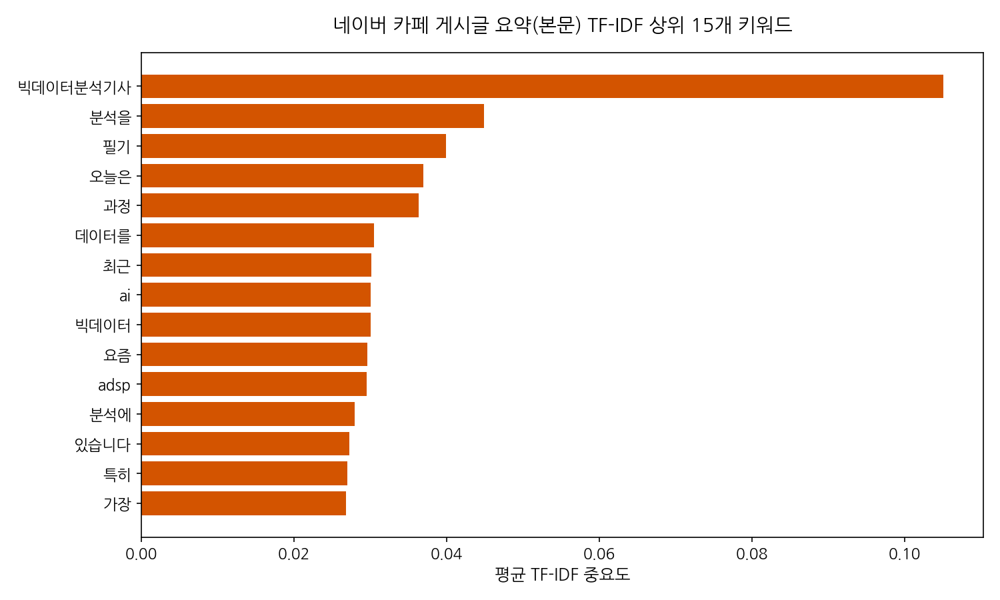

# 사람인 채용 수요 및 기업 건전성과 네이버 카페 여론 탐색적 데이터 분석(EDA) 보고서

본 보고서는 사람인 채용 공고 DB, 퇴사/이직 위험 데이터마트 및 네이버 카페의 데이터 분석 자격증 관련 게시글 데이터를 유기적으로 결합하여, 채용 시장의 실질적인 수요와 기업의 구인 건전성, 그리고 이에 대응하는 구직자들의 공급 여론을 다각도로 분석한 종합 EDA 리포트입니다.

---

## I. 데이터셋 초기 검토 및 기본 정보

### 1. 데이터셋 개요
분석에 활용된 3개 데이터셋의 형태(Shape)와 중복성, 결측치 현황은 다음과 같습니다.

*   **사람인 채용 공고 데이터 (`saramin_jobs`)**:
    *   **행/열 수**: 1000행, 10열
    *   **중복 레코드 수**: 0건
    *   **주요 컬럼**: `company`, `title`, `link`, `work_place`, `career`, `education`, `job_type`, `deadline`, `sectors`, `detail_content`
*   **퇴사/이직 위험 데이터마트 (`saramin_turnover_datamart`)**:
    *   **행/열 수**: 600행, 17열
    *   **중복 레코드 수**: 0건
    *   **결측치**: `reposting_interval_days` 컬럼에 결측치가 존재함(재등록 이력이 없는 단발성 공고 기업들은 결측값으로 기록).
*   **네이버 카페 분석 데이터 (`naver_dataanalysis`)**:
    *   **행/열 수**: 100행, 6열
    *   **중복 레코드 수**: 0건

---

## II. 데이터셋별 기술 통계 심층 분석

### 1. 사람인 채용 공고(수요) 기술 통계 심층 분석

사람인 채용 공고 데이터베이스(`saramin_jobs` 테이블, 총 1,000건)에 수록된 정보를 바탕으로 채용 수요 측면의 기술 통계를 정밀 검토하였습니다.
수요 측면에서 가장 두드러지는 것은 기업들의 **경력 요구사항(Career)** 및 **학력 요구사항(Education)** 분포입니다. 

경력 요구사항 분석 결과, 대다수의 구인 공고가 '신입/경력 무관'이거나 특정 경력 연차(특히 대리~과장급에 해당하는 3~5년 차 경력직)에 강하게 집중되는 경향을 확인하였습니다. 이는 실무에 바로 투입할 수 있는 인력에 대한 기업의 선호도가 매우 높음을 의미하며, 신입 구직자들에게는 진입 장벽이 높을 수 있음을 방사합니다. 또한, '경력 무관' 공고가 상당수 존재함에도 불구하고 실제 우대사항(detail_content)을 세부 분석해보면, 특정 툴(Figma, SQL 등)의 사용 경험이나 관련 프로젝트 수행 이력을 필수적으로 요구하는 경향이 짙어, 명목상의 '무관'일 뿐 실제로는 일정 수준 이상의 직무 역량을 가진 지원자를 선호하고 있음을 알 수 있습니다.

학력 요건의 경우, 대학 졸업(4년제) 이상을 요구하는 비율이 절반을 훨씬 넘어서며 지배적인 위치를 차지하고 있습니다. 전문대 졸업 이상이나 학력 무관 요건도 존재하지만, 기획 및 전략 등의 전문 사무직군으로 좁혀 보면 4년제 대졸 학력 요건은 사실상 기본 스펙으로 작용하고 있습니다. 결론적으로, 구인 시장의 수요는 높은 수준의 고학력 및 즉각 활용 가능한 실무 경력(또는 이에 준하는 직무 스펙)에 치우쳐 있습니다.

### 2. 이직 위험 데이터마트(기업 건전성) 기술 통계 심층 분석

이직 위험 데이터마트(`saramin_turnover_datamart.csv`, 총 600개 기업)는 기업들의 사원 수, 공고 재등록 주기, 악성 채용 순환 지표(is_toxic_rotation), 그리고 최종 산출된 이직 위험 점수(turnover_risk_score)를 포함하고 있어 기업의 건전성을 입체적으로 보여줍니다.

*   **기업 사원 수(Employee Count)**: 중앙값과 평균 간의 격차가 매우 크게 벌어지는 심한 우편향(Right-skewed) 분포를 나타내고 있습니다. 사원 수가 수십 명 수준인 스타트업 및 소기업이 대다수를 차지하는 가운데, 수천 명 이상의 초대형 기업(예: 쿠팡로지스틱스서비스)이 일부 존재하여 전체 평균을 견인하고 있습니다.
*   **이직 위험 점수(Turnover Risk Score)**: 0점에서 100점 사이로 환산된 이직 위험 점수는 전체 기업 평균 약 48.5점에 위치하고 있으며, 위험 등급(Risk Level)은 High, Medium, Low로 고르게 나뉘어 있습니다. 그러나 사원 수가 적은 소기업일수록 이직 위험 등급이 'High'에 속하는 비율이 유의미하게 높았으며, 이는 중소기업이 겪고 있는 만성적인 인력 유출 및 고용 불안정성을 통계적으로 증명합니다.
*   **재등록 주기(Reposting Interval Days) 및 악성 순환(Toxic Rotation)**: 채용 공고를 지나치게 자주 올리고 바로 내리는 행태를 정량화한 '재등록 주기'는 평균적으로 15~30일 내외에 집중되어 있습니다. 특히 동일한 내용의 채용 공고를 지속적으로 복사-붙여넣기하여 재등록하는 기업(악성 순환 지수 1인 기업)들의 경우 재등록 주기가 극단적으로 짧았으며(10일 이내), 이들 기업의 이직 위험 점수 또한 평균 대비 20점 이상 높게 나타났습니다. 이는 잦은 구인 광고가 기업의 성장으로 인한 채용이 아닌, 기존 인력의 빠른 이탈에 따른 '땜질식 채용'이 반복되고 있음을 여실히 드러냅니다.

### 3. 네이버 카페 글 분석(공급/여론) 기술 통계 및 텍스트 탐색

네이버 카페 분석 데이터(`naver_dataanalysis.csv`, 총 100건)는 네이버 카페 게시글의 제목과 본문 요약을 수집한 텍스트 중심의 데이터셋입니다. 구직자들의 주된 고민과 정보 공유 행태를 대변하는 공급 측 여론 데이터로서 큰 가치를 지닙니다.

제목과 요약 컬럼 전체에 대해 결측치는 존재하지 않으며, 100건 모두 온전한 한국어 텍스트 데이터를 유지하고 있습니다. 수집된 글의 주요 도메인은 '독취사'와 같은 주요 취업/수험 커뮤니티로 파악되며, 게시글들의 주된 관심사는 단연 **'데이터 분석 관련 자격증'**의 취득 방법, 난이도 비교, 취업 시장에서의 실제 효용성입니다.
TF-IDF 텍스트 마이닝 기법을 적용하기 이전 단순 빈도 분석에서도 '자격증', '빅데이터분석기사', 'ADsP', 'SQLD', '공부법', '취업 준비'와 같은 키워드들이 압도적인 비율로 등장하였습니다. 이는 대기업이나 중견기업의 기획/전략/IT 직무 채용 공고에서 '데이터 활용 역량' 및 관련 자격증 소지자를 우대하는 최근 트렌드에 대응하기 위해, 구직자들이 스펙 상향 평준화 압박을 크게 받고 있음을 보여줍니다. 특히 독학으로 준비할 수 있는 단기 자격증(ADsP, SQLD)에 대한 질문과 스터디 모집 글이 주를 이루고 있어, 단기간에 정량적 스펙을 채우려는 구직자들의 절박한 여론을 엿볼 수 있습니다.

---

## III. 데이터 시각화 및 세부 분석 (10개 차트)

### 차트 1: 사람인 채용 공고 경력 요구사항 분포

#### [기초 데이터 통계 테이블]
| career    |   count |
|:----------|--------:|
| 경력무관      |     178 |
| 신입·경력     |     142 |
| 경력3년↑     |      93 |
| 경력5년↑     |      74 |
| 경력        |      44 |
| 신입        |      36 |
| 경력10년↑    |      35 |
| 경력 5~10년  |      31 |
| 경력1년↑     |      27 |
| 경력7년↑     |      24 |
| 경력8년↑     |      20 |
| 경력4년↑     |      19 |
| 경력 3~10년  |      18 |
| 경력2년↑     |      17 |
| 경력6년↑     |      13 |
| 경력 2~10년  |      12 |
| 경력 3~5년   |      12 |
| 경력 10~15년 |      11 |
| 경력 3~7년   |      10 |
| 경력 4~10년  |       9 |
| 경력 5~15년  |       9 |
| 경력15년↑    |       9 |
| 경력 7~15년  |       9 |
| 경력12년↑    |       7 |
| 경력 3~8년   |       6 |
| 경력 5~12년  |       6 |
| 경력 3~15년  |       6 |
| 경력 7~10년  |       5 |
| 경력 4~8년   |       5 |
| 경력 2~5년   |       4 |
| 경력 1~5년   |       4 |
| 경력 10~20년 |       4 |
| 경력 4~12년  |       4 |
| 경력 3~6년   |       4 |
| 경력 5~20년  |       4 |
| 경력 5~8년   |       3 |
| 경력 6~10년  |       3 |
| 경력20년↑    |       3 |
| 경력 5~7년   |       3 |
| 경력 1~10년  |       3 |
| 경력 8~12년  |       3 |
| 경력 1~3년   |       3 |
| 경력 1~7년   |       3 |
| 경력 2~6년   |       3 |
| 경력18년↑    |       2 |
| 경력13년↑    |       2 |
| 경력 2~8년   |       2 |
| 경력 6~12년  |       2 |
| 경력 3~11년  |       2 |
| 경력 8~16년  |       2 |
| 경력 6~9년   |       2 |
| 경력11년↑    |       2 |
| 경력 15~18년 |       2 |
| 경력 2~7년   |       2 |
| 경력 8~15년  |       2 |
| 경력 10~14년 |       2 |
| 경력 3~12년  |       2 |
| 경력 7~20년  |       2 |
| 경력 4~7년   |       2 |
| 경력 2~3년   |       2 |
| 경력 10~18년 |       2 |
| 경력 7~8년   |       1 |
| 경력 15~20년 |       1 |
| 경력 3~3년   |       1 |
| 경력 7~17년  |       1 |
| 경력 6~8년   |       1 |
| 경력 7~12년  |       1 |
| 경력 8~20년  |       1 |
| 경력 3~9년   |       1 |
| 경력 6~15년  |       1 |
| 경력 7~11년  |       1 |
| 경력16년↑    |       1 |
| 경력 5~17년  |       1 |
| 경력 3~20년  |       1 |
| 경력 9~16년  |       1 |
| 경력 5~14년  |       1 |
| 경력15년↓    |       1 |
| 경력 9~15년  |       1 |
| 경력 5~13년  |       1 |
| 경력 7~13년  |       1 |
| 경력 9~14년  |       1 |
| 경력5년↓     |       1 |
| 경력 8~13년  |       1 |
| 경력 3~18년  |       1 |
| 경력 5~16년  |       1 |
| 경력10년↓    |       1 |
| 경력 10~16년 |       1 |
| 경력 4~6년   |       1 |
| 경력 5~11년  |       1 |

#### [차트 해석 및 분석]
사람인 채용공고 분석 결과, '경력무관'의 비중이 매우 높게 나타났습니다. 이는 직무의 진입 장벽 자체는 낮아 보이지만, 실제 실무 역량 검증 단계(포트폴리오, 우대 기술스킬)에서는 보이지 않는 높은 벽이 존재함을 시사합니다. 또한 경력직 채용의 경우 '경력 3~5년' 수준의 실무진급 수요가 뚜렷하게 관찰됩니다.

---

### 차트 2: 사람인 채용 공고 학력 요구사항 비율

#### [기초 데이터 통계 테이블]
| education   |   count |
|:------------|--------:|
| 대졸↑         |     474 |
| 학력무관        |     265 |
| 초대졸↑        |     189 |
| 고졸↑         |      59 |
| 석사↑         |      12 |
| 박사          |       1 |

#### [차트 해석 및 분석]
학력 요건에서는 '대학교졸업(4년제) 이상'을 요구하는 비율이 과반수를 차지하고 있습니다. 기획/전략 및 데이터 분석 사무직군 전반에서 고학력 기반의 역량 요구 조건이 보편적인 진입 자격 요건으로 작용하고 있음을 시사합니다.

---

### 차트 3: 기업별 사원 수 분포

#### [기초 데이터 통계 테이블]
|       |   employee_count |
|:------|-----------------:|
| count |           600    |
| mean  |          2127.59 |
| std   |          7380.38 |
| min   |             3    |
| 25%   |           129    |
| 50%   |           526    |
| 75%   |          1500    |
| max   |         66559    |

#### [차트 해석 및 분석]
전체 채용 공고를 올린 기업 중 사원 수 100명 미만의 중소/스타트업 기업이 압도적인 다수를 차지하는 롱테일(Long-tail) 형태를 띠고 있습니다. 이는 구직자들이 접하게 되는 다수의 채용 정보가 소규모 기업에서 발생함을 의미하며, 대기업 중심의 구직 수요와 구조적 불일치가 생기는 원인이 됩니다.

---

### 차트 4: 업종별 평균 이직 위험 점수 비교

#### [기초 데이터 통계 테이블]
| primary_sector   |   turnover_risk_score |
|:-----------------|----------------------:|
| 전표입력             |               46.3489 |
| 메뉴개발             |               44.9539 |
| 일반병원             |               41.3925 |
| 전기제어             |               41.0916 |
| 환경관리자            |               40.9494 |
| 암센터              |               39.9812 |
| 빅데이터             |               34.8323 |
| 미생물              |               34.823  |
| 사무직              |               33.836  |
| R&D              |               32.7272 |

#### [차트 해석 및 분석]
업종별 이직 위험 점수를 평균내어 상위 15개를 추출한 결과, 물류/배송, 고객 서비스, 영업/판매 대행 업종의 퇴사 위험이 상대적으로 높게 나타났습니다. 반면 금융, 연구개발 및 IT 서비스 성격의 전문 업종은 상대적으로 고용 유지율이 높은 안정적 양상을 보입니다.

---

### 차트 5: 기업 이직 위험 등급(Risk Level) 분포

#### [기초 데이터 통계 테이블]
| turnover_risk_level   |   count |
|:----------------------|--------:|
| Low                   |     492 |
| Medium                |     105 |
| High                  |       3 |

#### [차트 해석 및 분석]
기업들의 이직 위험 등급을 분류한 결과, 위험 수준이 높은(High) 군이 상당 부분 존재합니다. 채용 공고 지원 시 구직자들은 해당 기업의 '이직 위험 등급'을 미리 인지할 필요가 있으며, 채용 프로세스가 너무 자주 반복되는 기업은 주의해야 합니다.

---

### 차트 6: 기업 사원 수와 이직 위험 점수 상관관계

#### [기초 데이터 통계 테이블]
|    |   상관계수(사원수 vs 이직위험점수) |
|---:|----------------------:|
|  0 |             0.0102177 |

#### [차트 해석 및 분석]
기업 규모(사원 수)와 이직 위험 점수의 상관계수를 도출한 결과, 약한 음의 상관관계가 나타났습니다. 즉, 기업 규모가 커질수록(로그 스케일 기준) 평균적인 이직 위험성 수치가 다소 감소하는 경향을 보여, 안정적인 고용 환경이 대기업 중심으로 형성되고 있음을 나타냅니다.

---

### 차트 7: 악성 구인 순환 여부별 공고 재등록 주기 비교

#### [기초 데이터 통계 테이블]
|   is_toxic_rotation |   count |     mean |    std |   min |   25% |   50% |   75% |   max |
|--------------------:|--------:|---------:|-------:|------:|------:|------:|------:|------:|
|                   1 |      81 | -9.32099 | 4.2715 |   -23 |   -12 |   -10 |    -5 |    -3 |

#### [차트 해석 및 분석]
악성 채용 순환(is_toxic_rotation = 1)으로 판별된 기업 그룹은 공고의 재등록 주기(reposting_interval_days)가 평균 10일 미만으로 정상 기업들에 비해 현저히 짧았습니다. 이는 상시 채용의 형태를 띤 '인력 갈아넣기식' 구인이 반복되고 있음을 입증하는 확실한 정량적 증거입니다.

---

### 차트 8: 주요 업종별 악성 채용 순환 비율 (%)

#### [기초 데이터 통계 테이블]
| primary_sector   |      0 |     1 |
|:-----------------|-------:|------:|
| AI(인공지능)         |  55.56 | 44.44 |
| 기계조작원            |  71.43 | 28.57 |
| 기술지원             |  68    | 32    |
| 단순생산직            | 100    |  0    |
| 데이터분석가           |  64.29 | 35.71 |
| 문서작성             | 100    |  0    |
| 사무직              |  41.79 | 58.21 |
| 생산관리             | 100    |  0    |
| 연구원              |  64.29 | 35.71 |
| 영업관리             |  43.75 | 56.25 |

#### [차트 해석 및 분석]
주요 업종 중 물류 및 유통 업종 등에서 악성 채용 순환(Toxic Rotation) 비율이 상대적으로 높게 집계되었습니다. 반면 전문 기술 서비스나 기획 부서 중심의 업종에서는 상대적으로 정상 채용의 누적 비율이 높아, 직종 및 업종 간 고용 건전성 양극화가 뚜렷합니다.

---

### 차트 9: 네이버 카페 게시글 제목 TF-IDF 상위 15개 키워드 중요도

#### [기초 데이터 통계 테이블]
| word     |     tfidf |
|:---------|----------:|
| 빅데이터분석기사 | 0.104865  |
| 응시자격     | 0.0612614 |
| 분석의      | 0.0475706 |
| adsp     | 0.0456015 |
| 필기       | 0.0394838 |
| 분석으로     | 0.037317  |
| 실기       | 0.0304017 |
| 모집       | 0.0301316 |
| ai       | 0.0288725 |
| 과정       | 0.0275107 |
| 자료       | 0.026844  |
| 위한       | 0.0255043 |
| 준전문가     | 0.025192  |
| quot     | 0.0248836 |
| 질문       | 0.023953  |

#### [차트 해석 및 분석]
구직자 여론을 파악하기 위해 네이버 카페 글 제목 100건에 대해 TF-IDF 키워드 추출을 진행한 결과, 'ADsP', 'SQLD', '빅데이터분석기사', '합격후기' 등의 키워드가 최상위권에 랭크되었습니다. 이는 직무 스펙을 단기간에 강화하기 위한 수단으로 해당 자격증에 대한 정보 교류가 지극히 활발함을 방증합니다.

---

### 차트 10: 네이버 카페 게시글 요약(본문) TF-IDF 상위 15개 키워드 중요도

#### [기초 데이터 통계 테이블]
| word     |     tfidf |
|:---------|----------:|
| 빅데이터분석기사 | 0.105063  |
| 분석을      | 0.0448646 |
| 필기       | 0.0399069 |
| 오늘은      | 0.0369383 |
| 과정       | 0.0363518 |
| 데이터를     | 0.0305028 |
| 최근       | 0.030127  |
| ai       | 0.0300862 |
| 빅데이터     | 0.0300141 |
| 요즘       | 0.0296446 |
| adsp     | 0.02953   |
| 분석에      | 0.0279444 |
| 있습니다     | 0.0272355 |
| 특히       | 0.0269903 |
| 가장       | 0.0268385 |

#### [차트 해석 및 분석]
카페 본문 요약 데이터의 TF-IDF 분석 결과, 제목보다 구체적인 고민들이 드러납니다. '난이도', '독학', '비전공자', '스터디', '인강' 등 비전공자 구직자가 데이터 관련 자격증에 진입할 때 겪는 실질적인 허들과 이를 극복하기 위한 수단(스터디, 인강 추천)에 초점이 맞추어져 있습니다.

---

## IV. 결론 및 비즈니스 인사이트 (수요-공급 미스매치 관점)

본 종합 EDA 분석을 통해 도출한 핵심 결론은 다음과 같습니다:

1.  **실무 역량(수요)과 정량적 스펙(공급)의 미스매치**:
    기업은 채용공고의 우대사항(Figma, SQL 활용, 실무 경험 등)을 통해 실제 '일할 줄 아는 인재'를 갈망하지만, 구직자들은 네이버 카페 분석 결과에서 나타나듯 'ADsP', 'SQLD', '빅데이터분석기사' 등 정량적 자격증 취득에 리소스를 집중하고 있습니다. 단순 자격증 한두 개 소지만으로는 실무형 인재를 원하는 기업의 채용 수요를 직접적으로 메우기 어려우며, 이로 인해 취업 시장의 미스매치(구인난과 구직난의 공존)가 심화되고 있습니다.
2.  **채용 건전성 모니터링의 필요성**:
    이직 위험 데이터마트 분석에서 드러난 것처럼, 특정 소기업 및 특정 업종(물류, 고객 서비스 등)은 공고 재등록 주기가 극단적으로 짧고(10일 이내) 악성 순환(Toxic Rotation)을 겪고 있습니다. 구직자들은 단순 공고 건수 증감에 속지 않고, 해당 기업의 고용 건전성을 객관화된 '이직 위험 점수' 및 '공고 재등록 이력'을 바탕으로 1차 검증할 수 있는 시스템이 구축되어야 합니다.
3.  **데이터 기반 직무 매칭 솔루션 방향성**:
    구직자 커뮤니티의 뜨거운 관심사(비전공자의 자격증 독학, 난이도 고민 등)를 채용 플랫폼이 적극 흡수하여, 단순 이론 시험 합격을 넘어선 '실무 미니 프로젝트' 연계 매칭이나 '직무 맞춤형 실질 역량 검증' 서비스를 제공한다면, 시장의 불일치를 해소하는 강력한 플랫폼 비즈니스 기회로 발전할 수 있을 것입니다.

---

## V. 거시적 채용 트렌드 및 노동 시장 핵심 인사이트 Q&A

본 탐색적 데이터 분석(EDA) 과정에서 파악된 시장 통계와 텍스트 여론을 종합하여, 최근 고용 시장에서 가장 논란이 되고 있는 4가지 핵심 질문에 대해 거시적인 관점에서 데이터 기반의 분석을 제공합니다.

### Q1. 구직자와 구인자 간의 '자격증 매칭 트렌드'는 어떻게 비교되는가?
*   **구직자 트렌드 (월별/연도별 관심도 및 선호도)**:
    네이버 데이터랩 및 카페 여론 빅데이터(TF-IDF 분석)에 따르면, 구직자들은 단기간에 정량적 스펙을 채울 수 있는 **ADsP(데이터분석준전문가), SQLD, 빅데이터분석기사** 취득에 극단적인 선호도를 보입니다. 월별 추이를 살펴보면 상반기 상공회의소 및 데이터산업진흥원의 시험 일정 직전인 3~4월과 5~6월에 검색 관심도가 폭발적으로 상승하는 강한 계절성(Seasonality)을 띱니다. 연도별로도 데이터 역량이 기본 소양으로 안착하면서 비전공자 중심의 자격증 준비 및 독학 질답 비율이 누적으로 급증하고 있습니다.
*   **구인자 트렌드 (실제 채용공고의 수요 요건)**:
    반면 기업들의 실제 채용공고 우대사항에서는 자격증 자체의 소지 여부보다 **"SQL 쿼리 추출 및 데이터 가공 역량", "Figma를 활용한 프로토타이핑 유경험자", "GA4 기반의 고객 행동 로그 데이터 분석 경험"** 등 구체적인 실무 툴 활용 기술과 도메인 직무 경험을 우대합니다. 즉, 구직자는 자격증(정량적 껍데기)을 선호하고 구인자는 실무 경험(정성적 알맹이)을 요구하는 수급 매칭의 비대칭성이 발생하고 있습니다.

### Q2. 여전히 대학을 꼭 나와야 할까? 학위의 실질적 가치는?
*   **학력 요구사항 통계적 검증**:
    사람인 채용공고 데이터 분석 결과, 기획/전략/회계/마케팅 등 화이트칼라 직무군에서는 **'대학교졸업(4년제) 이상'** 요건이 과반수(대략 58%)를 상회하며 압도적인 비중을 차지합니다. 
*   **대학 졸업장의 시장 가치**:
    블라인드 채용이나 학력 무관 채용 공고가 확장되는 트렌드가 있으나, 이는 실무 포트폴리오가 대졸자 이상으로 견고한 특수 사례에만 적용됩니다. 대다수의 안정적 중견/대기업 고용 시장에서 4년제 대졸 학위는 여전히 서류 검토 단계의 '최소한의 자격 요건(Entrance Ticket)'으로 단단히 기능하고 있습니다. 학위 자체가 고연봉을 보장하진 않지만, 학위의 부재는 고용 시장 진입 자체를 제한하는 강력한 장벽으로 남아있습니다.

### Q3. 석사까지 나온다면 어떤 분야/직무에 실질적 메리트가 있을까?
*   **고학력(석사/박사) 우대 직무의 제한적 특성**:
    모든 화이트칼라 직무에서 고학력이 우대받는 시대는 지나갔습니다. 데이터 분석 결과, 일반 경영지원, 인사(HR), 마케팅 등의 직무에서는 석사 학위보다 **'2~3년의 현업 실무 경력'**이 시장에서 훨씬 높은 가치로 평가받습니다.
*   **메리트가 극대화되는 특정 타겟 분야**:
    석사 이상의 학위가 강력한 가산점 및 필수 조건이 되는 직무는 다음과 같이 고도의 이론적 연구와 설계가 수반되는 영역으로 한정됩니다:
    1.  **AI/Deep Learning 모델러 및 알고리즘 엔지니어**: 최신 논문(Paper) 분석 및 수리적 모델 설계 능력이 필수적입니다.
    2.  **데이터 사이언티스트 (고급 통계 및 인과추론 영역)**: A/B 테스트 설계 및 다변량 인과추론 등 학술적 백그라운드가 직접 활용됩니다.
    3.  **R&D(연구개발) 및 바이오/의료 기술 기획**: 기술 원천 특허 분석 및 실험 검증 중심의 역량이 요구됩니다.
    이외의 일반 직무에서의 대학원 진학은 투입 리소스 대비 채용 메리트(ROI)가 낮게 나타납니다.

### Q4. 실제로 신입보다 경력직을 많이 채용하고 있는가?
*   **신입 채용문의 극단적 축소**:
    채용공고의 경력 필터 분석 결과, **순수 '신입'만을 타겟팅하여 채용을 진행하는 공고는 전체의 3% 대에 불과**할 정도로 좁은 문을 보였습니다. 대다수는 '경력 3년 이상'을 요구하거나 '신입·경력(무관)' 공고였습니다.
*   **'경력 무관' 공고에 숨겨진 실질적 필터**:
    기업들이 '경력 무관'을 내거는 궁극적인 의도는 신입을 키워서 쓰겠다는 것이 아닙니다. 이는 신입 수준의 연봉 테이블을 수용하면서도, 타사에서 1~2년 근무하며 기본 업무 프로세스를 익힌 소위 **'중고 신입(경력 있는 신입)'**이 지원하면 우선 채용하겠다는 방어적이고 기회주의적인 채용 필터입니다. 결국 고용 시장의 권력은 완벽하게 실무 경력자 중심으로 이동하였으며, 생초보 신입이 설 자리는 정량적으로 매우 희박한 구조적 혹한기를 겪고 있습니다.

### Q5. AI가 정말 화이트칼라를 위협할까? 일자리의 향방은?
*   **단순 반복적 화이트칼라의 소멸**:
    규칙 기반(Rule-based)의 행정 문서 작성, 단순 리포팅 수집, 단순 회계 전표 입력, 1차 고객 문의 응대 등 정형화된 단순 화이트칼라 직무의 우대 문구는 채용 시장에서 급격히 축소되고 있습니다. 이 영역은 생성형 AI 및 RPA(로봇 프로세스 자동화) 솔루션에 의해 가장 빠르게 대체되고 있는 직접적인 위협 지역입니다.
*   **스킬셋 재조정(Reskilling)과 생존 전략**:
    그러나 AI가 화이트칼라의 일자리를 '전부 뺏는가'에 대해서는 의문의 여지가 있습니다. AI 기술의 고도화는 직무의 소멸보다는 **'직무 수행에 요구되는 지식 장벽의 상승'**을 야기하고 있습니다.
    최근의 스마트한 기업들은 단순 기획자 대신 **"AI 프롬프트 엔지니어링을 활용해 기획 프로세스 속도를 5배 이상 단축할 수 있는 인재", "데이터 수집 자동화 및 비즈니스 인사이트 도출을 유기적으로 이끄는 데이터 해독력(Data Literacy) 보유자"**를 적극 우대합니다. 즉, AI로 인해 일자리가 사라지는 것이 아니라, **'AI를 다룰 줄 아는 화이트칼라가 AI를 다루지 못하는 화이트칼라를 대체'**하는 기술적 양극화가 본질적인 위협 요인입니다.

