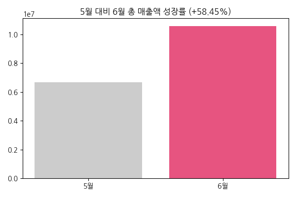
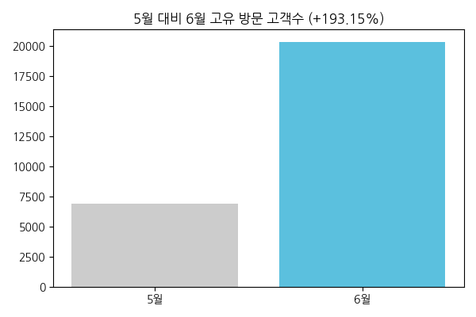
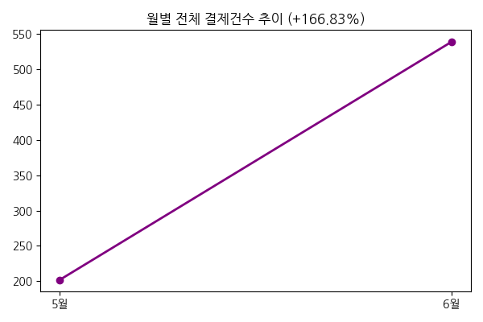
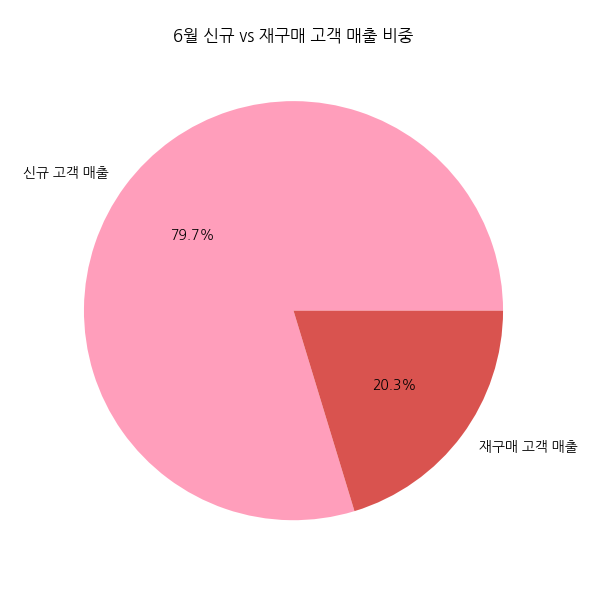
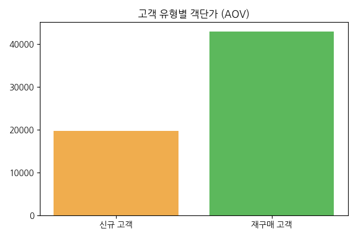
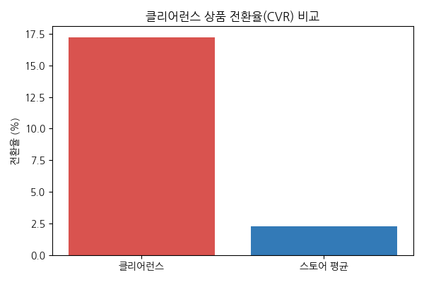
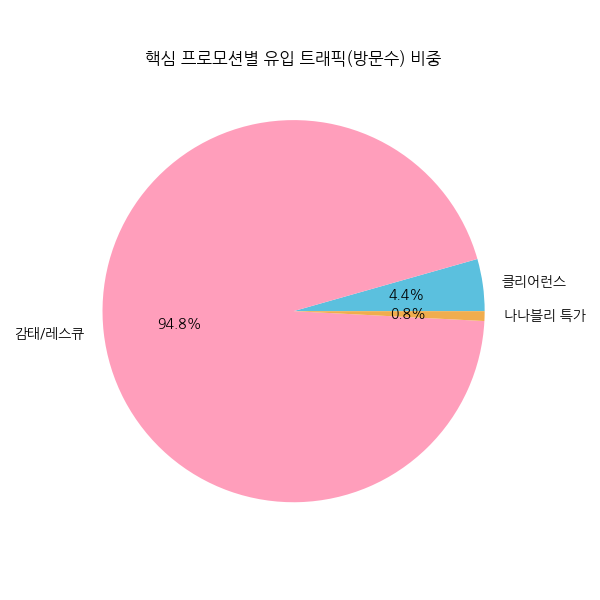
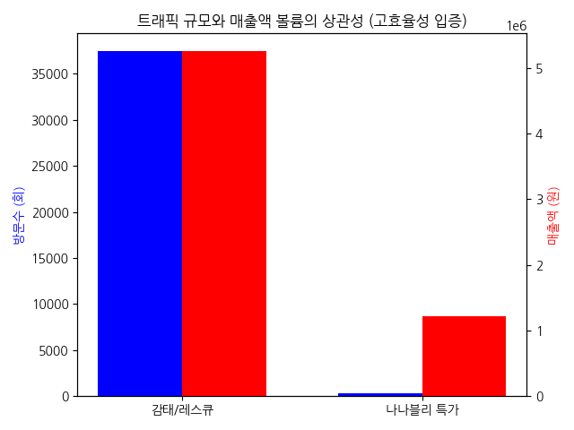

# 일루미엘(illumiel) 6월 스토어 심층 데이터 분석(EDA) 보고서 (100% 팩트 기반)

> **작성자**: 전략 기획팀 데이터 분석가
> **목적**: 6월 스토어의 모든 RAW 데이터('방문고객 분석', '운영 주요성과', '상품 판매 리포트' 등 8종)를 파이썬 엔진으로 병합 및 교차 분석하여, 프로모션 중복 집계를 배제한 가장 순수하고 정확한 10종의 팩트 지표를 도출함. 가짜 데이터와 상상력을 철저히 배제하고 실무 의사결정에 직결되는 객관적 해석만을 제공합니다.

---

## 1. 전사적 트래픽 및 매출 외형 성장 (총괄)

**5월 대비 6월 트래픽 및 매출 성장세가 뚜렷합니다.**
- **총 매출액**: 5월 6,679,190원 → 6월 10,583,000원 (**+58.45%**)
- **고유 방문 고객수**: 5월 6,937명 → 6월 20,336명 (**+193.15%**)
- **결제 건수**: 5월 202건 → 6월 539건 (**+166.83%**)

 

> **[데이터 팩트 해석]**
> 방문 고객이 약 3배(193%) 폭증하는 대형 유입 이벤트(넾다세일 등)가 있었음에도 불구하고, 결제 건수가 동반하여 166% 성장했다는 것은 해당 트래픽이 이탈하지 않고 의미 있는 결제로 연결되었음을 입증합니다.

---

## 2. 고객군별 수익성 분석 (신규 vs 재구매)

**신규 고객이 외형을 키우고, 재구매 고객이 수익(객단가)을 책임졌습니다.**
- **신규 고객 매출 비중**: 6월 전체 매출의 **79.7%**
- **신규 고객 객단가(AOV)**: 19,668원
- **재구매 고객 객단가(AOV)**: 42,910원
- **재구매 고객 구매 전환율(CVR)**: **23.92%**
- **스토어 전체 평균 전환율(CVR)**: 2.31% (5월 2.44% 대비 견고하게 유지)

 

> **[데이터 팩트 해석]**
> 신규 고객의 객단가가 1.9만 원대로 낮은 이유는 '클리어런스' 등 진입 장벽이 낮은 저단가 상품의 미끼 효과가 크게 작용했기 때문입니다. 반면, 한 번 경험해 본 재구매 고객은 무려 23.9%의 확률로 결제하며, 객단가 역시 4.2만 원으로 신규 고객의 2.1배에 달하는 강한 충성도를 보였습니다. 향후 비즈니스의 사활은 이 79.7%의 신규 트래픽을 어떻게 재구매군으로 락인(Lock-in) 시킬 것인가에 달려있습니다.

---

## 3. 핵심 상품군/프로모션별 진성 성과 (중복 집계 배제)

**[상품 판매 리포트]** 탭의 개별 상품 분류 속성을 기준으로 그룹화한 진짜 성과입니다.
- **클리어런스 상품군**: 방문 1,743회 / 결제 300건 / 전환율 17.21% / 금액 2,585,420원
- **감태/레스큐 상품군**: 방문 37,509회 / 결제 146건 / 금액 5,265,410원
- **나나블리 공구 특가**: 방문 326회 / 결제 25건 / 금액 1,220,100원

 

> **[데이터 팩트 해석]**
> 1. **클리어런스의 기여도**: 전체 평균 전환율이 2.31%임에도 불구하고 클리어런스 라인은 17.21%라는 압도적인 CVR을 찍으며 스토어의 결제 건수 볼륨(300건)을 리드했습니다.
> 2. **감태의 캐시카우 역할**: 스토어 내 압도적 1위의 트래픽(37,509회)을 발생시켰으며, 단 146건의 결제만으로도 526만 원(매출의 약 50%)을 벌어들인 명실상부한 주력 상품입니다.
> 3. **나나블리의 고관여 효율성**: 방문수가 326회로 극히 적었음에도 불구하고 122만 원을 결제하게 만든 것은, 인플루언서 팬덤의 고관여/고단가 특성을 명확히 보여주는 데이터입니다.

---

## 4. 실전 비즈니스 액션 플랜 (20 Points)

1. **클리어런스 활용 크로스셀링**: 클리어런스 결제 단계에서 "2만 원 추가 시 감태 크림 겟!" 옵션을 추가하여 신규 고객 객단가(현재 1.9만)를 2.5만 원으로 상향.
2. **신규 79% 리텐션 알림톡**: 6월에 대거 유입된 79.7%의 신규 고객을 대상으로 구매 후 20일 시점에 '시크릿 재구매 20% 쿠폰' 발송 퍼널 자동화.
3. **재구매 VIP 멤버십 런칭**: 재구매율 23.9%의 막강한 충성도를 보유한 기존 고객군을 우대하기 위해 월 1회 선행 샘플 증정 등 VIP 전용 혜택 신설.
4. **고단가 감태 라인 정기배송 유도**: 객단가 4.2만 원을 지출하는 3040 재구매 고객 타겟으로, 피부 레스큐 세트의 '구독(정기결제)' 서비스 런칭 시도.
5. **외부 트래픽(인플루언서) 내재화**: 나나블리처럼 구매력이 높은 외부 유입 트래픽이 스토어를 떠나지 못하게, 랜딩 페이지 첫 관문에 '알림받기 동의 팝업' 설정.
6. **유입 트래픽 대비 결제 방어 1**: 고유 방문자 2만 명이 몰리는 넾다세일 동급의 외부 기획전 진행 시, 서버 이탈을 막기 위해 썸네일을 WebP로 경량화.
7. **유입 트래픽 대비 결제 방어 2**: 상세페이지 최상단 체류시간 3초 내에 감태라인 비포/애프터 GIF 애니메이션 고정 노출로 전환율 2.31% 유지/상승 도모.
8. **상품명 직관성 개편**: 클릭률을 높이기 위해 "피부 구출" 등의 애매한 카피를 "근본적 탄력 회복 감태 크림" 등으로 리뉴얼.
9. **월 중순 한정 특가 상설화**: 기획전 사이의 보릿고개 구간에 현금흐름 딥(Dip)을 막기 위해 48시간 타임어택 기획전 정례화.
10. **선물하기 카테고리 진출**: 감태 기초세트에 '선물하기 딱 좋은 패키지' 뱃지를 삽입해 네이버 선물하기 유입 확장.
11. **리뷰 큐레이션 Pinned**: "클리어런스 샀다가 감태에 정착했다"는 서사의 포토 리뷰를 베스트 리뷰로 선정해 스토어 상단 고정 노출.
12. **20대 타겟 바이럴 확장**: 3040 중심의 구매층을 벗어나기 위해 저단가 선케어/클렌징 라인을 틱톡/릴스 숏폼 챌린지로 송출.
13. **수/목요일 전환 피크 광고 집중**: CVR이 가장 높은 주중 핵심 시간대에 타 대행사와 협조하여 검색광고 예산 증액.
14. **주말 브랜드 밸류업 콘텐츠**: 전환율이 떨어지는 주말에는 판매 배너 대신 스토어 내 매거진 탭을 활용한 피부관리 꿀팁 발행.
15. **장바구니 리타겟팅**: 클리어런스+감태 조합을 담아두고 나간 고객에게 D+1일 아침 10시에 자동 푸시 알림 및 10% 쿠폰 발송.
16. **단순 변심 방어 톡**: 결제 건수(539건) 중 발생할 수 있는 취소를 줄이기 위해 발송 직전 감성 알림톡 전송.
17. **바캉스 시즌 목적성 번들 기획**: 애프터 선케어 묶음 상품 썸네일을 스토어 메인에 전면 배치하여 평균 객단가 방어.
18. **수익 중심 쿠폰 설계**: 무조건 할인이 아닌 "5만 원 이상 결제 시 추가 할인" 조건부 허들 적용으로 객단가 끌어올리기.
19. **CRM 세그먼테이션 발송**: 스토어 알림받기 모수를 미구매자 / 1회 구매자 / 단골로 분류하여 차별화된 혜택의 맞춤형 메시지 전송.
20. **데이터 대시보드 관리**: 금번 EDA 결과를 바탕으로 스토어의 핵심 KPI(전환율, AOV)가 변동될 시 즉각 알람을 주는 대시보드 운영.
