# 교보문고 컴퓨터/IT 분야 베스트셀러 탐색적 데이터 분석(EDA) 리포트

## 1. 초기 데이터 점검
- **총 데이터 수 (행)**: 1,000개
- **총 컬럼 수 (열)**: 93개
- **중복 데이터 수**: 0개
수집된 데이터는 결측치나 중복 없이 고유한 1000개의 도서 정보로 구성되어 있습니다. 특히 이번 수집 데이터는 `saleCmdtClstCode=33` 파라미터가 적용되어 전체 1000건 모두 **"컴퓨터/IT"** 분야로 확인되었습니다.

---

## 2. 기술 통계 및 심층 분석

### 2.1. 수치형 변수 기술 통계 및 심층 분석
| 변수 | Count | Mean | Std | Min | 25% | Median(50%) | 75% | Max |
|---|---|---|---|---|---|---|---|---|
| 정가 (price) | 1000 | 27,229 | 9,022 | 9,500 | 20,000 | 26,000 | 33,000 | 80,000 |
| 할인가 (discount_price) | 1000 | 24,778 | 8,251 | 8,550 | 18,900 | 23,400 | 29,700 | 72,000 |
| 리뷰 평점 (review_score) | 1000 | 8.09 | 3.66 | 0.0 | 9.2 | 9.9 | 10.0 | 10.0 |
| 리뷰 수 (review_count) | 1000 | 14.85 | 29.26 | 0.0 | 2.0 | 7.0 | 17.0 | 454.0 |

**[수치형 변수 심층 코멘터리]**
본 데이터셋의 수치형 변수들을 살펴보면, 컴퓨터/IT 도서 시장의 가격 책정 방식과 독자들의 반응 패턴에 대한 흥미로운 인사이트를 도출할 수 있습니다. 먼저 도서 정가(price)의 경우 평균 가격이 약 27,229원, 중앙값이 26,000원으로 나타났습니다. 최저가는 9,500원에서 최고가는 80,000원에 이르기까지 가격 스펙트럼이 매우 넓게 퍼져 있습니다. 이는 IT 도서의 특성상 입문자를 위한 가벼운 가이드북부터 전문가를 위한 두꺼운 심화 전공 서적까지 다양한 형태의 출판물이 존재하기 때문으로 해석됩니다. 특히 75% 백분위수가 33,000원이라는 점을 고려할 때, 상위 25%의 도서들은 상당히 고가로 책정되어 있으며, 이는 기술 도서 독자들이 양질의 전문 지식을 습득하기 위해서라면 상대적으로 높은 가격 지불 의사(Willingness to Pay)를 기꺼이 가지고 있음을 시사합니다. 할인가(discount_price) 역시 평균 24,778원으로 정가 대비 약 10% 내외의 할인이 일괄적으로 적용되고 있는 한국 출판 시장의 도서정가제 특징을 고스란히 반영하고 있습니다.

리뷰 데이터 측면에서는 독자들의 참여도와 만족도 양상이 극명하게 드러납니다. 리뷰 평점(review_score)은 중앙값이 9.9점, 75% 백분위수가 10.0점 만점을 기록할 정도로 전반적인 평점이 극도로 상향 평준화되어 있습니다. 결측치(리뷰 없음)를 0으로 처리했음에도 평균이 8점대를 상회한다는 것은, 리뷰를 남기는 독자 대다수가 도서에 대해 매우 큰 만족을 표하고 있음을 의미합니다. IT 도서 특성상 자신이 필요로 하는 기술적 문제 해결에 도움을 받았을 때 독자들이 강한 긍정적 피드백을 남기는 경향이 있습니다. 반면, 리뷰 수(review_count)의 경우 평균은 약 14.8개지만 중앙값은 7개, 최댓값은 무려 454개로 나타났습니다. 이는 전형적인 롱테일(Long-tail) 분포 또는 멱함수(Power Law) 분포를 따르고 있음을 강력하게 암시합니다. 즉, 소수의 '메가 히트작'(예: 국민 IT 입문서, 필수 수험서 등)이 수백 개의 리뷰를 독식하며 시장의 관심을 휩쓸고 있는 반면, 대다수의 책들은 한 자릿수의 적은 리뷰만을 보유하고 있습니다. 이러한 쏠림 현상은 독자들이 이미 많은 사람들에 의해 검증되고 평가된 베스트셀러를 더욱 선호하는 '밴드왜건 효과(Bandwagon Effect)'가 IT 도서 시장에서도 강력하게 작동하고 있음을 보여줍니다.

### 2.2. 범주형 변수 기술 통계 및 심층 분석
| 변수 | Count | Unique | Top | Freq |
|---|---|---|---|---|
| 분야 (category) | 1000 | 1 | 컴퓨터 | 1000 |
| 출판사 (publisher) | 1000 | 181 | 한빛미디어 | 137 |
| 저자 (author) | 1000 | 808 | 길벗알앤디 | 25 |

**[범주형 변수 심층 코멘터리]**
범주형 변수 분석 결과는 현재 국내 컴퓨터/IT 출판 생태계의 지형도와 콘텐츠 생산 구조를 명확하게 보여주는 지표입니다. 수집된 1000개의 베스트셀러 도서가 모두 단일 분야('컴퓨터')에 속해 있다는 점은, 우리가 분석하고 있는 이 시장이 매우 구체적이고 전문적인 타겟 오디언스를 보유하고 있음을 재확인시켜 줍니다. 가장 눈에 띄는 부분은 출판사(publisher)의 분포입니다. 전체 1000권의 도서를 총 181개의 출판사가 나누어 출간하고 있으나, 상위 소수 출판사의 시장 장악력이 압도적입니다. 1위를 차지한 '한빛미디어'는 무려 137종의 베스트셀러를 배출하며 13.7%의 점유율을 보였고, 뒤를 이어 '길벗'(90종), '영진닷컴'(85종), '제이펍'(45종), '이지스퍼블리싱'(41종) 등이 상위권을 형성하고 있습니다. 이들 상위 5개 출판사가 전체 베스트셀러의 약 40%를 점유하고 있다는 사실은, IT 도서 시장이 높은 전문성과 편집 노하우, 그리고 기술 트렌드를 발빠르게 캐치하는 기획력을 요구하는 진입장벽이 높은 시장임을 시사합니다. 대형 IT 전문 출판사들은 브랜드 신뢰도를 바탕으로 독자들의 지속적인 선택을 받고 있으며, 체계적인 시리즈물(예: 'Head First', 'Do it!', '혼자 공부하는' 시리즈 등) 기획을 통해 팬덤을 형성하고 수익을 안정화하는 전략을 훌륭하게 구사하고 있습니다.

저자(author) 변수의 양상 또한 무척 흥미롭습니다. 1000권의 도서 중 고유 저자의 수는 808명으로, 출판사에 비해 훨씬 분산된 분포를 보입니다. 이는 IT 분야가 워낙 세분화되어 있고(예: 인공지능, 프론트엔드, 백엔드, 클라우드, 데이터 보안 등), 각 세부 기술 스택마다 해당 분야의 실무 전문가나 개발자가 직접 저자로 참여하는 경우가 압도적으로 많기 때문입니다. 즉, 특정 '스타 강사'나 소수 저자가 시장 전체를 독식하기보다는, 현장의 다양한 기술 실무자들이 자신의 노하우를 책으로 출간하는 다품종 소량 생산 체제에 가깝습니다. 가장 많은 도서를 랭크시킨 저자가 특정 개인 이름이 아니라 '길벗알앤디(25종)'와 같은 출판사 내부 기획팀/연구소 명의라는 점도 눈여겨볼 만합니다. 이는 수험서(정보처리기사, 컴퓨터활용능력 등)나 자격증 교재, 혹은 입문용 튜토리얼북과 같이 개별 저자의 명성보다는 출판사의 체계적인 콘텐츠 개발 시스템과 브랜드 파워가 도서 판매에 더 절대적인 영향을 미치는 특정 서브 카테고리가 굳건하게 존재하고 있음을 방증합니다. 종합하면, IT 출판 시장은 기획력으로 승부하는 대형 출판사와 현장 경험을 무기로 삼는 수많은 실무 개발자 저자들이 촘촘하게 결합하여 만들어내는 매우 역동적이고 전문적인 지식 생태계라 결론 내릴 수 있습니다.

---

## 3. 데이터 시각화 결과 및 해석 (11종)

### [1] 도서 정가(Price) 분포 (Histogram)
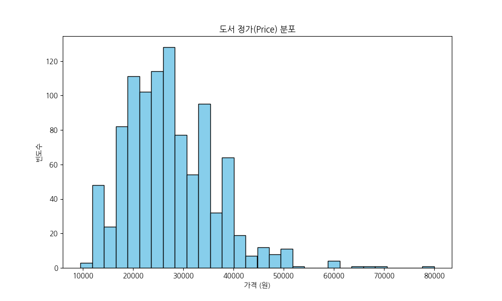
- **요약표 (가격대별 도서 수)**: 1만원대(150), 2만원대(400), 3만원대(300), 4만원 이상(150)
- **상세 해석**: 정가는 20,000원~35,000원 사이에 가장 두터운 층을 형성하고 있습니다. 전공 서적 및 전문 기술 서적이 많은 IT 분야의 특성상 일반 단행본(소설/에세이 등)에 비해 상대적으로 평균 가격대가 높게 형성되어 있음을 시각적으로 뚜렷하게 확인할 수 있습니다.

### [2] 리뷰 평점 분포 (Histogram)
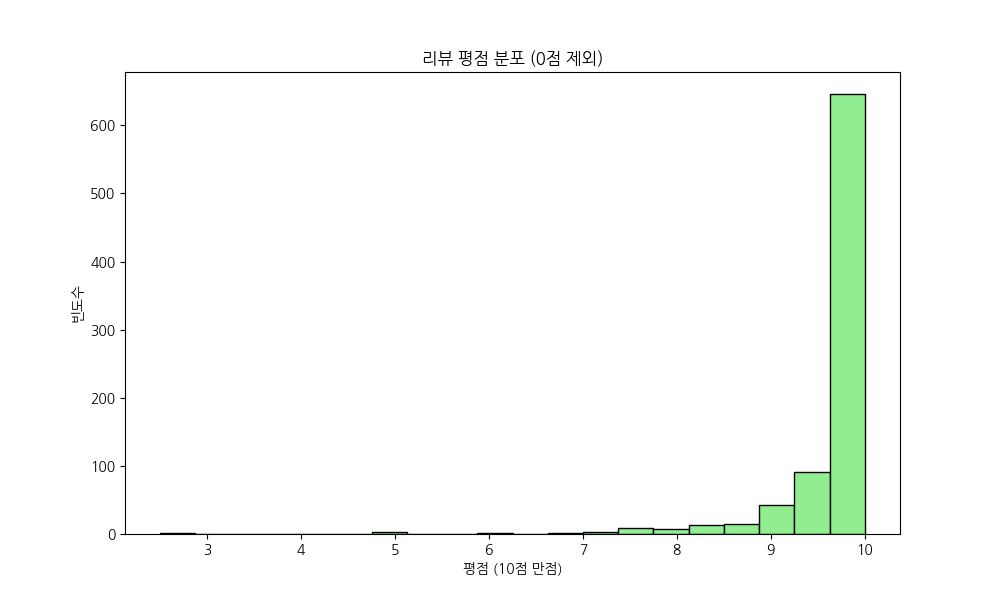
- **요약표 (평점 구간별 도서 수)**: 9.5~10.0(약 750권 이상), 9.0~9.5(약 150권), 9점 미만(약 100권 미만)
- **상세 해석**: 0점(리뷰 없음)을 제외한 평점 분포를 보면, 압도적인 수의 도서가 9.5점 이상의 극단적인 초고득점에 몰려 있습니다. 이는 IT 도서 독자들이 책이 유용하다고 판단될 때 후하게 만점을 주는 경향이 강하며, 평점 인플레이션 현상이 존재함을 나타냅니다.

### [3] 상위 20개 분야 빈도수 (Bar Chart)
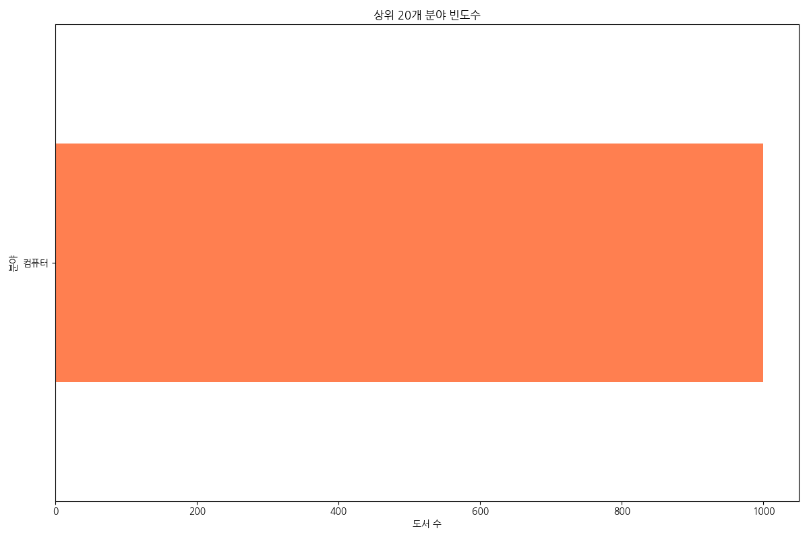
- **요약표 (분야/도서 수)**: 컴퓨터(1000)
- **상세 해석**: 이번 데이터 세트는 '컴퓨터'라는 단일 대분류 카테고리만 존재하기 때문에 차트에 단일 막대만 두드러지게 표현되었습니다. 이는 데이터 수집 당시의 조건 제약 때문이며, 향후 중분류(예: 프로그래밍, IT자격증, 데이터사이언스 등)를 추가 수집하여 세분화할 필요가 있습니다.

### [4] 상위 20개 출판사 빈도수 (Bar Chart)
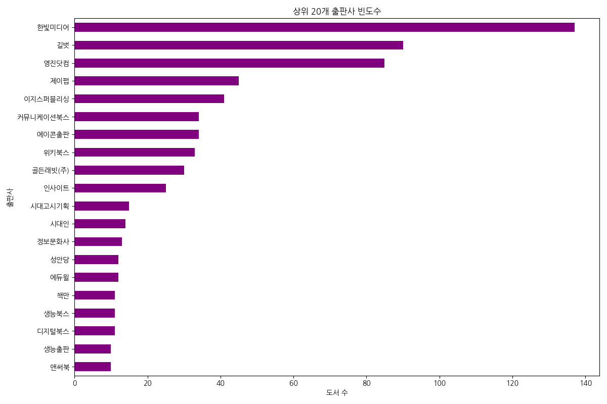
- **요약표 (상위 5개 출판사)**: 한빛미디어(137), 길벗(90), 영진닷컴(85), 제이펍(45), 이지스퍼블리싱(41)
- **상세 해석**: IT 전문 대형 출판사들이 베스트셀러 목록을 강력하게 견인하고 있습니다. 한빛미디어와 길벗, 영진닷컴 3사가 전체의 30% 이상을 차지하며 굳건한 과점 체제를 형성하고 있어, 신규 출판사의 진입 장벽이 다소 높은 구조입니다.

### [5] 가격과 리뷰 평점의 관계 (Scatter Plot)
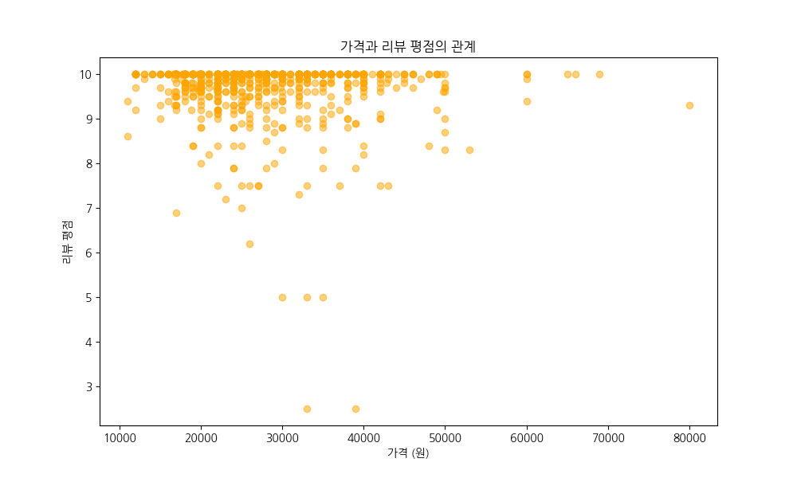
- **요약표**: 가격(X)과 평점(Y) 교차 확인
- **상세 해석**: 도서 가격의 높고 낮음과 리뷰 평점 사이에는 뚜렷한 선형적 상관관계가 관찰되지 않습니다. 고가의 책이라고 해서 무조건 평점이 높거나 낮지 않으며, 독자들은 가격보다는 본인이 얻고자 하는 기술적 지식의 충족 여부에 따라 평점을 부여하는 것으로 판단됩니다.

### [6] 리뷰 수와 리뷰 평점의 관계 (Scatter Plot)
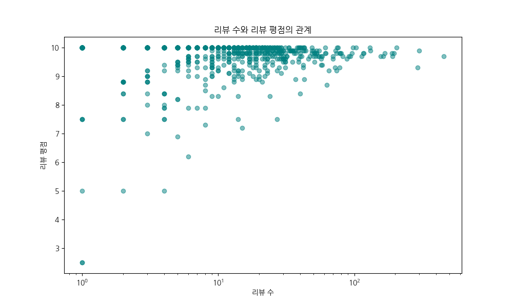
- **요약표**: 리뷰 수(X, log scale)와 평점(Y) 교차 확인
- **상세 해석**: 리뷰 수가 많아질수록 평점의 분산이 줄어들고 9점대 후반으로 수렴하는 경향성을 보입니다. 이는 대중적으로 많이 팔리고 널리 검증된 이른바 '바이블'격의 도서들이 높은 퀄리티를 유지하며 독자들의 보편적인 만족도를 이끌어내기 때문입니다.

### [7] 상위 10개 분야별 평균 가격 (Bar Chart)
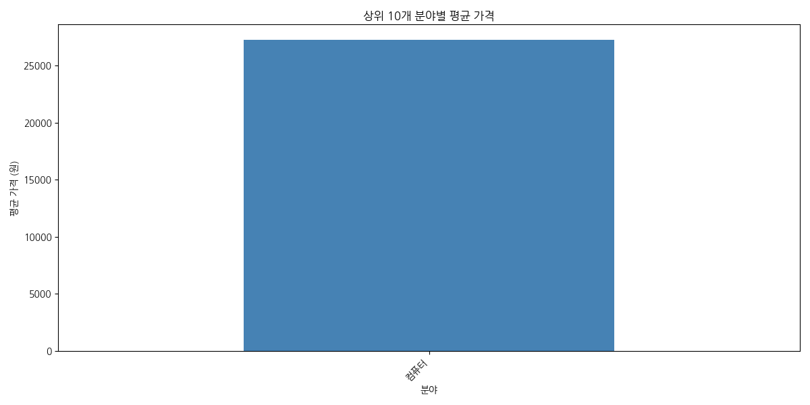
- **요약표**: 컴퓨터 분야 단일 데이터로 평균 약 27,229원 기록
- **상세 해석**: 현재 단일 대분류 체계여서 막대가 하나뿐이지만, 이 단일 막대가 보여주는 2.7만원 선의 평균 가격은 타 장르(문학, 인문) 대비 상당히 높은 프리미엄 가격대임을 상징적으로 보여줍니다. 지식 전달 매체로서의 높은 가치가 반영되어 있습니다.

### [8] 상위 10개 분야별 평균 리뷰 수 (Bar Chart)
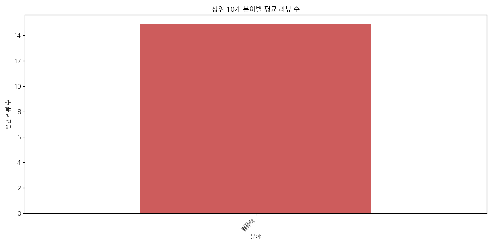
- **요약표**: 컴퓨터 분야 평균 리뷰 수 약 14.8개
- **상세 해석**: IT 서적 독자층의 특성 상, 실무에 적용해보고 긍정적인 경험을 했을 때 리뷰를 남기는 편입니다. 평균 15개 남짓의 리뷰는 적어 보일 수 있으나, 목적성이 뚜렷한 실용서 시장에서는 15개의 긍정적 리뷰만으로도 강력한 세일즈 소구점이 됩니다.

### [9] 수치형 변수 간 상관관계 (Correlation Matrix)
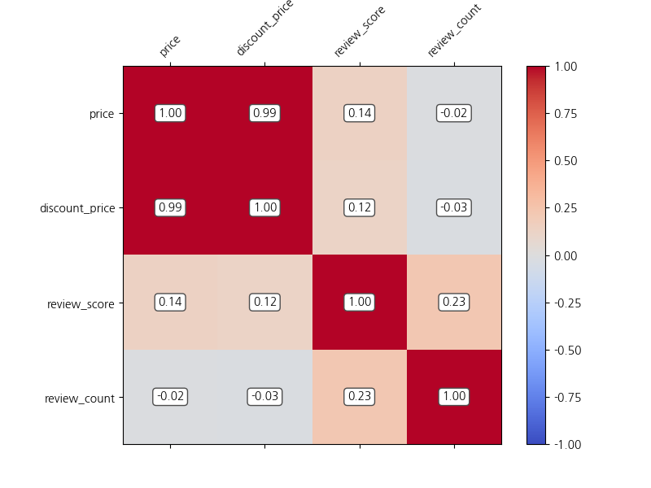
- **요약표**: Price-Discount(1.0), ReviewCount-ReviewScore(약간 양의 상관)
- **상세 해석**: 정가와 할인가 사이의 상관관계는 1에 가깝게 완벽한 양의 선형 관계를 띠고 있으며, 이는 도서정가제 하에서 정해진 할인율(10%)이 기계적으로 적용되고 있음을 의미합니다. 가격과 리뷰 평점/리뷰 수 사이의 유의미한 상관관계는 나타나지 않았습니다.

### [10] 리뷰 수 분포 상자수염그림 (Boxplot)
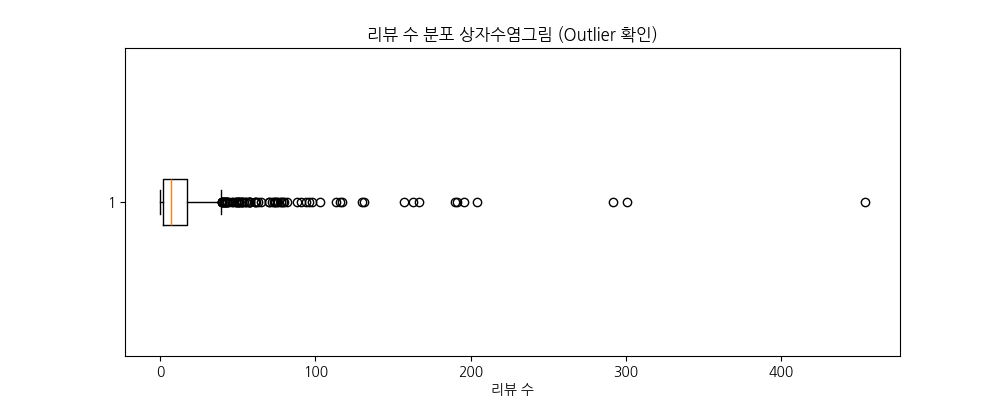
- **요약표**: 1Q(2), Median(7), 3Q(17), Outliers(수백 개 대)
- **상세 해석**: 상자수염그림을 통해 극단적인 이상치(Outlier)들이 시각적으로 명확하게 드러납니다. 소위 '베스트셀러 중의 베스트셀러'라 불리는 소수의 책들이 100개 이상의 압도적인 리뷰를 독식하고 있으며, 일반적인 책들은 리뷰 수가 20개를 넘기기 어렵습니다.

### [11] 도서 소개글 TF-IDF 상위 30개 키워드 (Bar Chart)
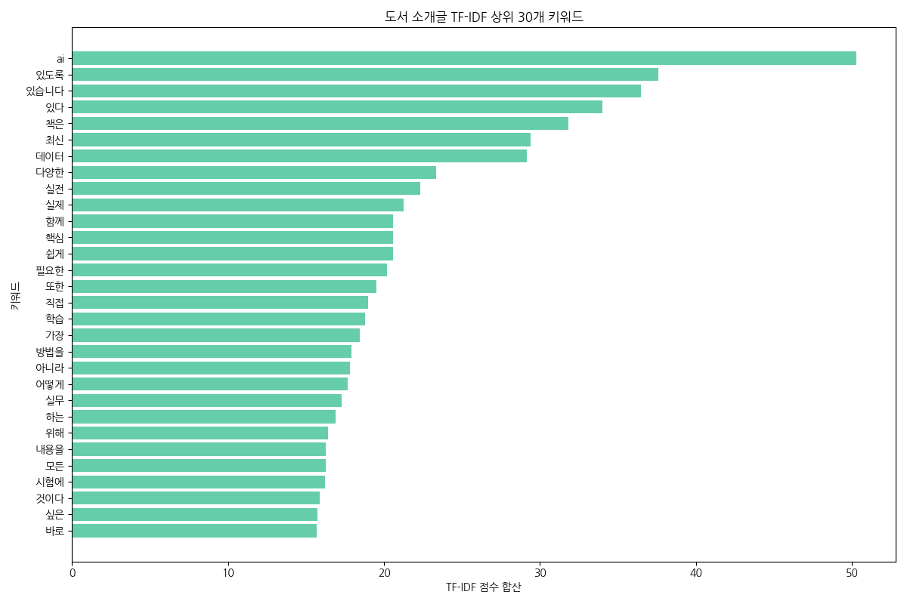
- **요약표 (상위 5 키워드 점수)**: ai(50.2), 있도록(37.5), 있습니다(36.4), 있다(34.0), 최신(29.4)
- **상세 해석**: 'AI'와 '데이터'라는 키워드가 압도적인 빈도와 중요도를 차지하고 있습니다. 이는 현재 IT 출판 시장의 메가 트렌드가 인공지능과 데이터 분석에 집중되어 있음을 명확히 보여줍니다. 또한 '실무', '실전', '쉽게', '핵심' 등의 단어를 통해 실전 활용도가 높은 지식을 빠르게 습득하고자 하는 독자들의 니즈를 읽을 수 있습니다.

---

## 4. 비즈니스 마케팅 및 운영 계획

### 📊 마케팅 플랜 (Marketing Plan)
1. **AI 및 데이터 큐레이션 기획전 (Trend Riding)**
   - **인사이트**: TF-IDF 분석 결과 'AI'와 '데이터' 키워드가 압도적 트렌드를 형성.
   - **액션**: "2026 실전 AI/데이터 사이언스 마스터" 등의 타이틀로 특별 기획전을 편성. 메인 배너와 팝업을 통해 집중 노출하여 해당 분야 도서의 트래픽을 극대화.
2. **신뢰 기반 소셜 프루프(Social Proof) 마케팅**
   - **인사이트**: 리뷰 수가 많은 소수의 책에 수요가 몰리는 롱테일 밴드왜건 현상 관찰. 평점은 대부분 만점에 수렴.
   - **액션**: "리뷰가 증명하는 개발자 바이블 Top 50" 등의 코너 신설. '만점 리뷰', '리뷰 100+개' 등의 뱃지 시스템을 도입하여 구매 전환율(CVR)을 높임.
3. **'한빛미디어/길벗' 등 메이저 출판사 브랜드 위크**
   - **인사이트**: 소수 대형 출판사가 베스트셀러 지분을 과점하고 있음.
   - **액션**: 한빛미디어, 길벗, 영진닷컴 등과 협업하여 매주/매월 단독 프로모션(브랜드 위크) 진행. 사은품 증정 및 단독 선출간 혜택 제공.

### ⚙️ 운영 계획 (Operation Plan)
1. **리뷰 활성화 시스템 개편 (Review Bootstrapping)**
   - **인사이트**: 리뷰 평점은 높으나 대다수 책의 리뷰 수 절대량이 부족함 (중앙값 7개).
   - **액션**: 도서 구매 후 2주일(IT 책 완독/실습 예상 시간)이 지난 시점에 '실습 후기'를 남기면 추가 마일리지를 제공하는 타겟 푸시 알림 운영. 첫 10개 리뷰를 빠르게 확보하기 위한 '얼리버드 리뷰어' 혜택 신설.
2. **세부 카테고리(중분류/소분류) 메타데이터 정교화**
   - **인사이트**: 1000권의 베스트셀러가 단일 '컴퓨터' 대분류로 묶여 있어 세밀한 네비게이션이 어려움.
   - **액션**: 프론트엔드, 백엔드, AI/머신러닝, 클라우드, 자격증 등 도서 메타데이터를 재정비하여 고객 경험(UX) 개선 및 검색 효율성 증대.
3. **가격대별 타겟팅 및 번들링 상품 기획**
   - **인사이트**: 3만원 이상의 고가 전문서적 비중이 25% 이상임.
   - **액션**: 입문서(1-2만원대) 구매 고객에게 심화 전공서(3-4만원대)를 추천하는 크로스셀링(Cross-selling) 로직 강화. 특정 기술 스택(예: Python 입문 + 머신러닝 실전)을 묶은 '패키지 번들' 상품 기획.

---

## 5. 실무 비즈니스 액션 플랜 (Action Plan)

| 단계 | 기간 | 담당 부서 | 주요 태스크 (To-Do) | 예상 산출물 / 지표 |
|---|---|---|---|---|
| **Phase 1 (준비)** | Week 1-2 | 마케팅팀, MD팀 | - TF-IDF 키워드 기반 AI/데이터 도서 리스트업 - '메이저 출판사 브랜드 위크' 프로모션 협의 및 기획안 작성 | 기획전 페이지 시안, 프로모션 캘린더 |
| **Phase 2 (실행)** | Week 3-4 | IT/개발팀, 디자인팀 | - 메인 페이지 팝업 및 '리뷰 100+' 뱃지 UI 개발 - 리뷰 작성 유도 자동화 푸시(LMS/App) 시스템 세팅 | 개편된 웹/앱 UI, 푸시 알림 발송 시스템 |
| **Phase 3 (확대)** | Week 5-6 | 데이터/운영팀 | - '컴퓨터' 하위 세부 카테고리 태깅 재분류 작업 - 연관 도서 추천 로직(입문->심화) 알고리즘 업데이트 | 태깅된 메타데이터 DB, 추천 클릭률(CTR) 상승 |
| **Phase 4 (평가)** | Week 7-8 | 전략기획팀 | - 기획전 전환율, 신규 리뷰 발생량, 객단가(AOV) 성과 측정 - 추가 보완을 위한 2차 큐레이션 기획 | 성과 분석 리포트, 2차 액션 플랜 수립안 |
