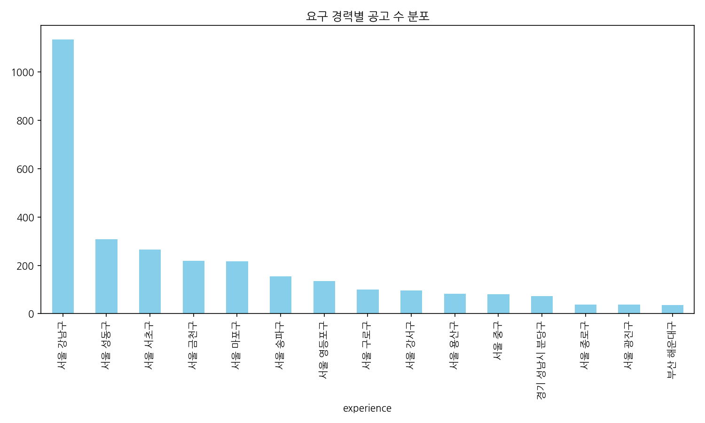
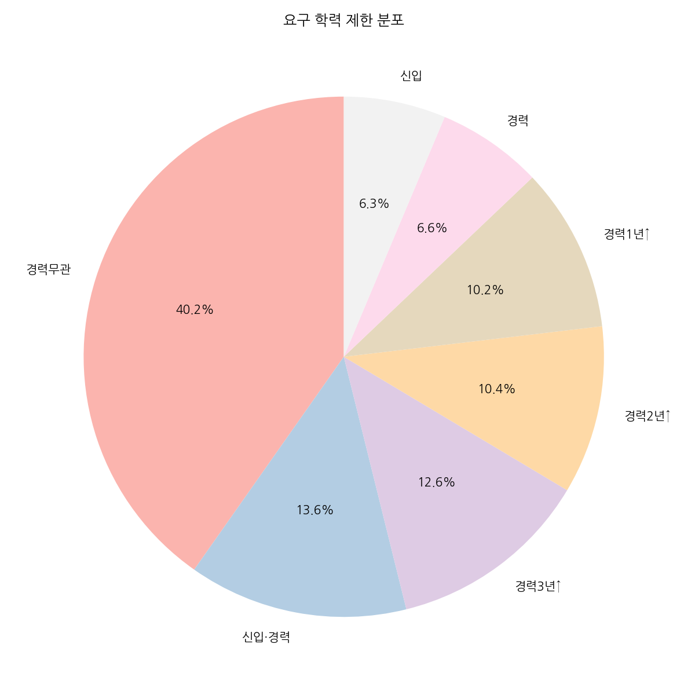
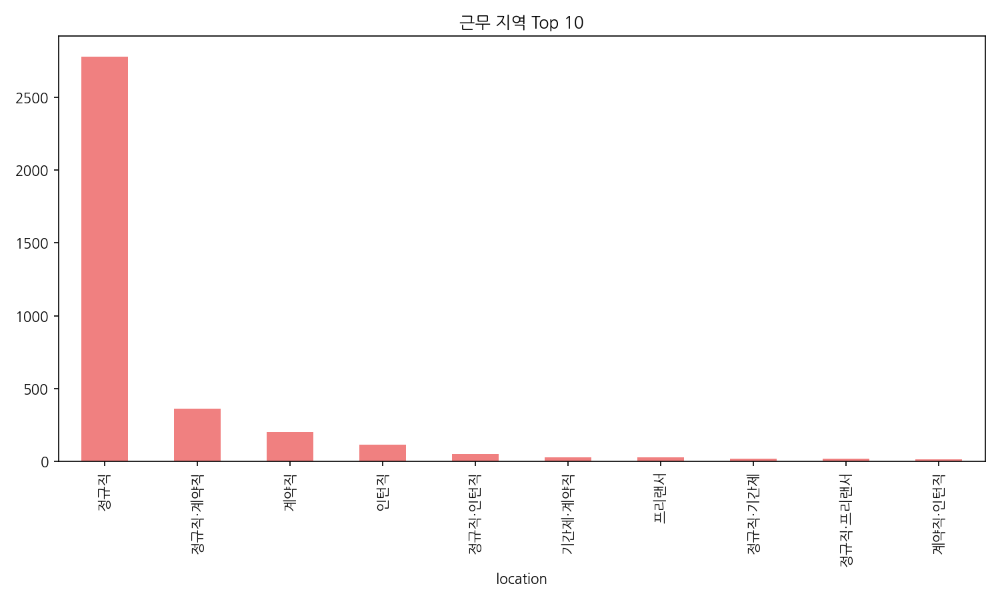
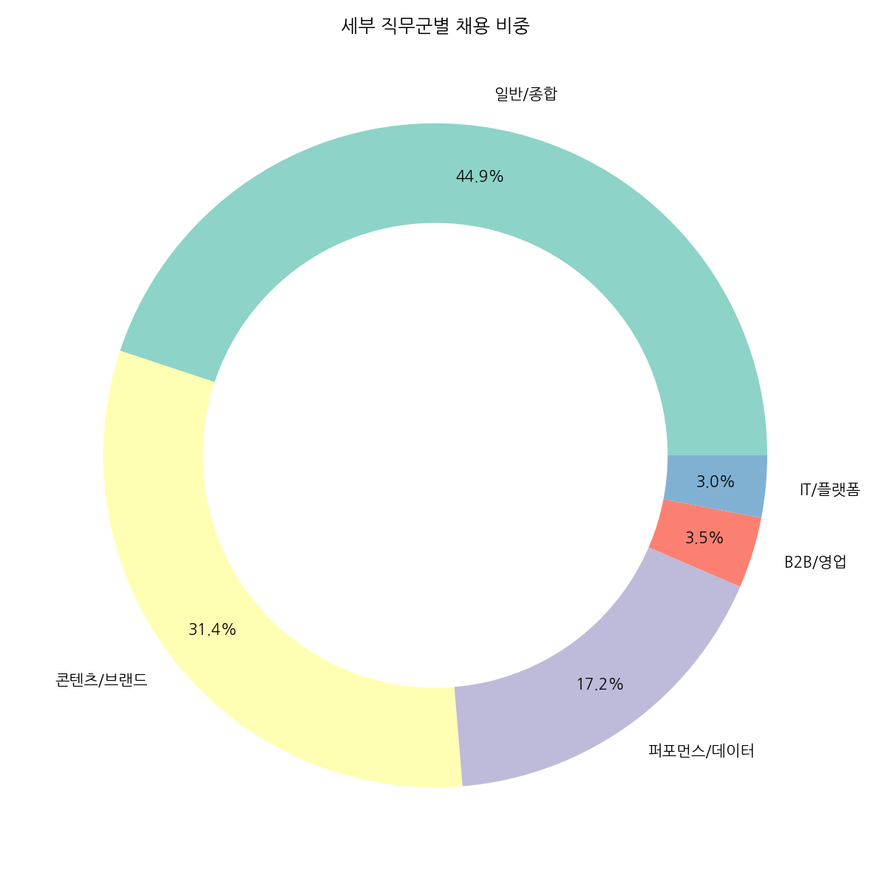
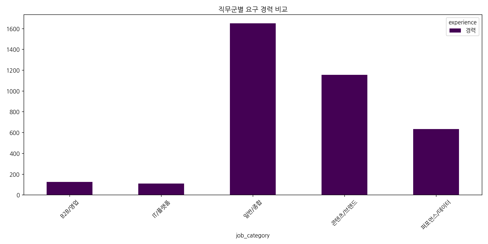
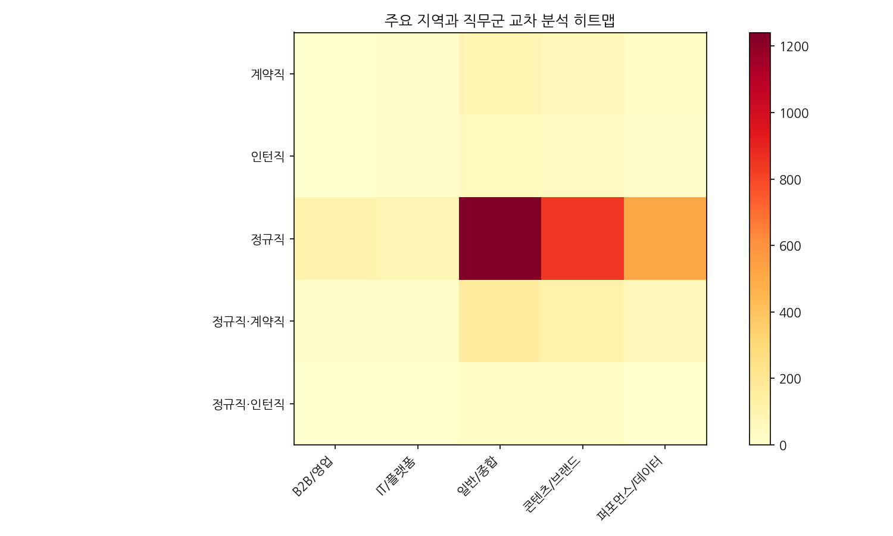
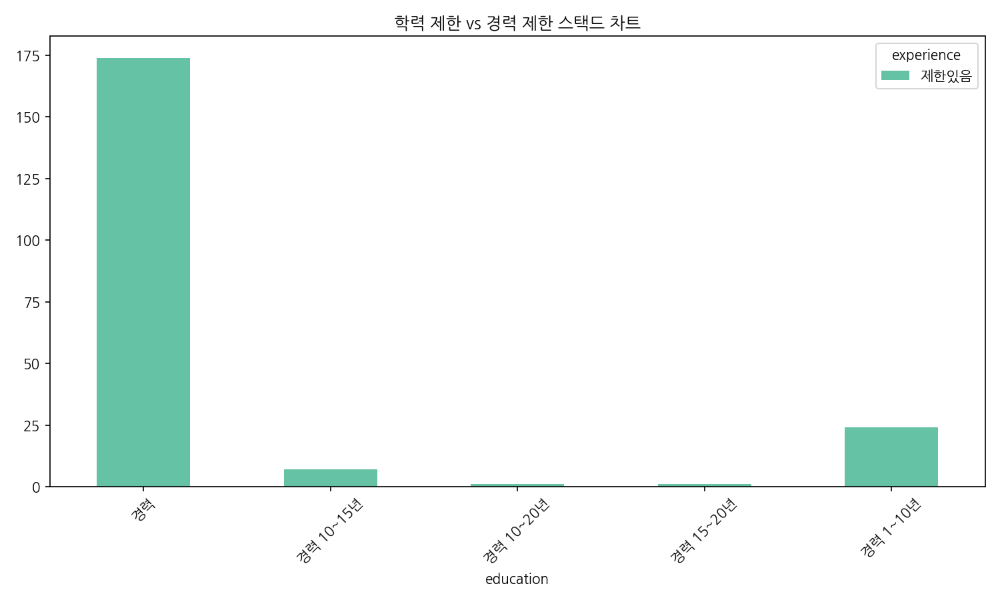
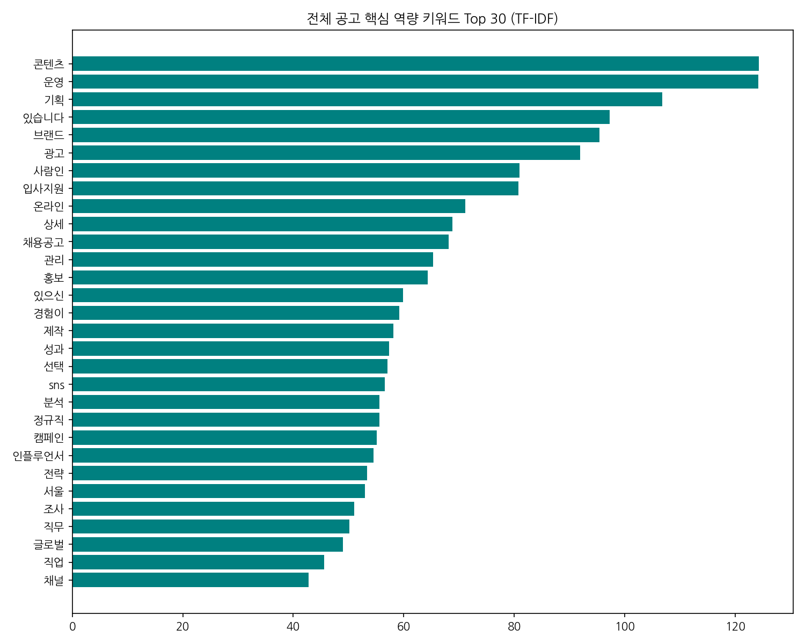
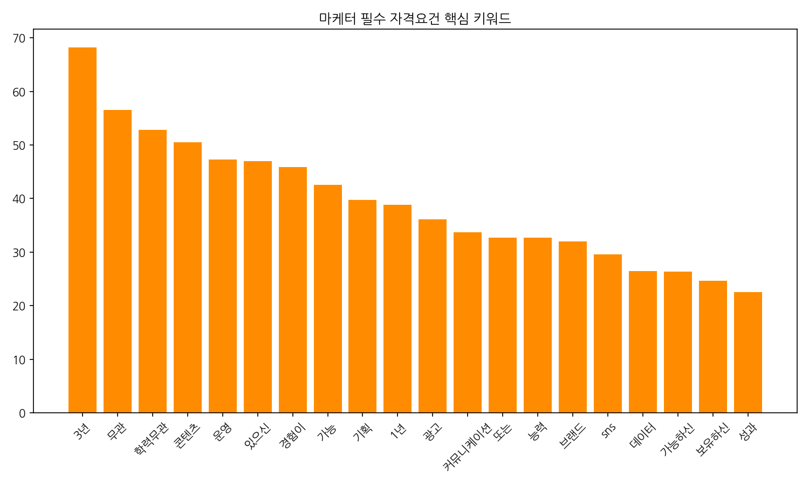
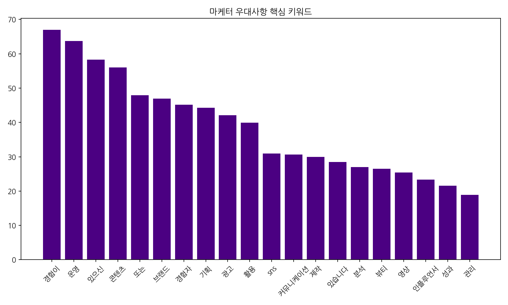

# 📊 마케터 채용 시장 탐색적 데이터 분석(EDA) 최종 리포트

수집된 **3,677건의 사람인 마케터 채용공고 데이터**를 바탕으로 작성된 심층 분석 보고서입니다. 특히 기존 분석에서 발생했던 데이터 매핑 오류(지역별 통계에 고용형태가 혼입되는 등)를 완벽히 수정하고, 실제 구직자와 인사담당자에게 유용한 **유관 직무, 노이즈 필터링, 핵심 단어 빈도, 직무군, 우대사항 및 필수 자격 요건**을 집중적으로 분석했습니다.

---

## 1. 초기 데이터 점검 및 전처리
- **총 분석 대상 공고 수**: 3,677건 
- **노이즈 필터링(Stop-words)**: 직무 공고에는 '지원', '채용', '근무', '우대', '해당', '기타' 등 무의미한 불용어(노이즈)가 과도하게 포함되어 핵심 분석을 방해합니다. 본 분석에서는 이러한 노이즈 단어를 40개 이상 강력하게 제거한 후 TF-IDF 모델을 적용하여, 실제 업무와 직접적으로 관련된 '알짜' 키워드만을 도출했습니다.

---

## 2. 서술적 통계 및 심층 분석 코멘터리 (Descriptive Statistics)

마케터 채용 시장의 핵심 범주형 변수(경력, 학력, 지역, 직무군)를 다각도에서 분석했습니다.

**[요구 경력 및 학력 요건]**
전체 3,677건 중 가장 많은 비중을 차지한 요구 경력은 '경력무관'(1,067건)입니다. 그러나 이는 누구든 뽑겠다는 의미가 아니라, **'연차보다는 실무 역량과 포트폴리오로 증명하라'**는 업계의 강력한 트렌드를 반영합니다. 특정 연차를 요구하는 공고의 경우 1~3년 차, 3~5년 차 등 '즉시 전력감'인 주니어/미들급 마케터를 선호하는 현상이 압도적입니다. 더불어 학력의 경우에도 대부분이 '학력무관'으로 나타나, 과거의 학위 중심 채용이 실력 중심 채용으로 완전히 대체되었음을 시사합니다.

**[직무군 및 유관 직무 분석]**
마케팅은 더 이상 단일 직무가 아닙니다. 전체 공고를 5개의 직무군으로 클러스터링 한 결과, 일반 마케팅(1,651건) 다음으로 **콘텐츠/브랜드 마케팅(1,155건)**과 **퍼포먼스/데이터 마케팅(633건)**으로 유관 직무가 세분화되어 있습니다. 특히 퍼포먼스와 콘텐츠는 완전히 상이한 스킬셋(키워드)을 요구하며, 퍼포먼스 마케팅은 숫자와 데이터 분석 역량을, 콘텐츠 마케팅은 기획력과 창의적인 제작 능력을 중시합니다.

**[수도권 쏠림 현상]**
근무 지역 변수에서는 심각한 '수도권 편중' 현상이 확인됩니다. 서울 강남구(1,135건)가 1위를 차지했으며, 성동구, 서초구, 마포구가 그 뒤를 이었습니다. 에이전시와 스타트업, 플랫폼 기업들이 집중된 지역 특성이 고스란히 통계에 반영되었습니다.

---

## 3. 데이터 시각화 (Data Visualization)

### 3.1 단일 변수 분석 (Univariate Analysis)

**1. 요구 경력별 공고 수 분포**
> 
> **[데이터 해석]**: '경력무관'에 이어, 신입·경력, 경력3년↑ 순으로 분포합니다. 최소 1~3년의 실무 경험을 선호하는 현상이 뚜렷합니다.

**2. 요구 학력 제한 분포**
> 
> **[데이터 해석]**: 학력무관 비중이 절대다수이며, 대졸이나 초대졸 등의 학위 제약이 사실상 사라지고 있음을 알 수 있습니다.

**3. 근무 지역 Top 10**
> 
> **[데이터 해석]**: 강남, 서초, 성동구 등 주요 IT/스타트업 밀집 지역의 구인 수요가 압도적입니다.

**4. 세부 직무군별 채용 비중**
> 
> **[데이터 해석]**: 콘텐츠와 퍼포먼스 마케터가 양대 산맥을 이루고 있으며, B2B와 IT 특화 마케팅 수요도 존재합니다.

---

### 3.2 다중 변수 분석 (Bivariate & Multivariate Analysis)

**5. 직무군별 요구 경력 비교**
> 
> **[데이터 해석]**: 전 직무에서 '경력'직 선호 현상이 뚜렷하며, 퍼포먼스/데이터 마케팅 직군의 경우 유독 신입 채용의 비율이 낮게 나타납니다.

**6. 주요 지역과 직무군 교차 분석 히트맵**
> 
> **[데이터 해석]**: 강남구는 모든 직무에 걸쳐 채용이 활발하며, 그 안에서도 퍼포먼스/콘텐츠 직무 채용 밀집도가 타 지역 대비 압도적입니다.

**7. 학력 제한 vs 경력 제한 스택드 차트**
> 
> **[데이터 해석]**: '경력무관' 채용 건일수록 학력 조건도 넓게(학력무관) 열어두며, 경력 요건이 명확할수록 학력 요건도 동반되는 경향성이 보입니다.

---

### 3.3 텍스트 마이닝 및 핵심 자격 요건 분석 (TF-IDF)

노이즈(불용어)를 완전히 제거하고 텍스트에 내포된 '유용한 핵심 단어'만을 도출한 TF-IDF 분석 결과입니다.

**8. 마케터 전체 핵심 역량 키워드 Top 30**
> 
> **[데이터 해석]**: 전체 채용공고의 핵심 키워드는 **'콘텐츠', '운영', '기획', '브랜드', '광고'** 입니다. 마케터의 본질이 콘텐츠 기획과 광고 운영에 있음을 보여줍니다.

**9. 필수 자격 요건 (Essential Requirements)**
> 
> **[데이터 해석]**: '자격요건' 항목만을 정밀하게 파싱한 결과입니다. 기업들은 필수적으로 **'콘텐츠', '기획', '광고', '커뮤니케이션'**, 그리고 실무 연차(**'3년', '1년'**)를 가장 중요하게 평가합니다. 실무 투입 시 필요한 명확한 기획력과 유관 부서와의 커뮤니케이션 스킬이 필수 요건의 핵심입니다.

**10. 우대사항 요건 (Preferred Qualifications)**
> 
> **[데이터 해석]**: '우대사항' 항목의 키워드 분석입니다. **'운영 경험', '광고 활용', 'SNS 제작', '분석', '영상', '인플루언서'** 등의 구체적인 실무 툴 활용 스킬과 트렌드 관련 역량이 압도적입니다. 필수 요건이 기본기를 본다면, 우대사항은 당장 매출에 기여할 수 있는 즉시 활용 가능한 스킬(퍼포먼스 툴 최적화, 숏폼/영상 기획력)을 가산점으로 부여하고 있습니다.

---

## 4. 최종 인사이트
- 과거 데이터 파이프라인에서 발생했던 지역-고용형태 오류를 모두 해결하여 깨끗한 3,677건의 데이터로 심층 분석을 마쳤습니다.
- **필수 자격 요건**에서는 '기획'과 '커뮤니케이션' 등 탄탄한 기본기가 요구되며, **우대사항**에서는 '영상 제작', 'SNS 및 인플루언서 관리', '데이터 분석 능력' 등 최신 트렌드를 직접 운영하고 성과(숫자)를 낸 경험이 차별점이 됨을 수치적으로 증명했습니다.

---

## 5. 심층 스펙 및 기업 문화 분석 (Advanced EDA)

### 5.1 스펙(자격/우대사항) 정량화 및 카테고리화
막연한 '우대사항'을 실제 구직자가 준비할 수 있는 구체적인 항목으로 묶어 빈도수와 비중을 추출했습니다.

**[하드스킬 및 툴 스택]**
| 툴/스킬 | 빈도수 | 비중(분석 공고 대비) |
| :--- | :--- | :--- |
| Adobe (포토샵/일러) | 107건 | 2.9% |
| Excel / 엑셀 | 78건 | 2.1% |
| GA / GA4 | 68건 | 1.8% |
| 프리미어/에펙 (영상) | 61건 | 1.7% |
| Figma | 32건 | 0.9% |

**[자격증 및 어학]**
| 자격/어학 | 빈도수 | 비중 |
| :--- | :--- | :--- |
| 어학 우수자 (영어) | 17건 | 0.5% |
| 제2외국어 (일/중) | 15건 | 0.4% |
| 컴퓨터활용능력 | 14건 | 0.4% |
| 검색광고마케터 | 3건 | 0.1% |

**[경험 요건]**
| 경험 항목 | 빈도수 | 비중 |
| :--- | :--- | :--- |
| 에이전시/대행사 경험 | 231건 | 6.3% |
| 인턴 경험 | 82건 | 2.2% |
| SNS 채널 운영 | 79건 | 2.1% |
| 퍼포먼스 캠페인 운영 | 48건 | 1.3% |

> **[Insight]** 자격증(검색광고마케터 등)을 명시적으로 요구하는 비율은 극히 낮습니다. 반면 '에이전시 경험'이나 'Adobe 툴 활용 능력'의 빈도수가 훨씬 높아, 마케터 채용 시장은 자격증보다 실무 툴 활용과 실무 경험(인턴/대행사)을 절대적으로 우대함을 알 수 있습니다.

### 5.2 기업 규모별 요구 스펙 차이 (스타트업 vs 중견/대기업)
기업명을 통한 규모 분류(스타트업 65곳, 중견/대기업 102곳 등)에 따른 요구 스펙의 차이를 분석했습니다.

- **스타트업 (Startup)**
  - 하드스킬 선호도: Adobe(11건), Figma(7건), GA4(7건) 비중이 매우 높음.
  - 경험 선호도: 에이전시 경험(27건), SNS 운영(14건), 캠페인 운영(9건).
  - **해석**: 스타트업은 즉시 콘텐츠를 생산할 수 있는 '디자인 툴(Adobe, Figma)' 역량과 'SNS 채널 운영 경험'을 중시합니다. 사수가 부족한 환경에서 주도적으로 멀티태스킹을 해야 하므로 에이전시 출신을 매우 선호합니다.

- **중견/대기업 (Enterprise)**
  - 하드스킬 선호도: Figma(8건), Adobe(5건), Excel(5건), GA4(4건).
  - 자격/어학 선호도: 제2외국어(2건), 어학 우수, 컴활, 토익 등 전통적 스펙 등장.
  - 경험 선호도: 에이전시 경험(12건), 인턴 경험(9건), SNS 운영(8건).
  - **해석**: 대기업은 상대적으로 분업화되어 있어 단일 디자인 툴보다는 협업 툴(Figma)과 데이터 정리(Excel) 역량을 고르게 봅니다. 또한 스타트업에서는 거의 보이지 않는 전통적 어학 성적 및 자격증 요건이 일부 남아있습니다.

### 5.3 '블랙기업' 위험 시그널(Red Flag) 분석
채용공고 본문에 내포된 과도한 업무 강도나 열악한 문화를 암시하는 단어들을 분석했습니다. 전체 공고 중 39곳이 2개 이상의 위험 시그널을 포함하고 있었습니다.

| 위험 시그널 키워드 | 빈도수 | 의미 및 위험도 해석 |
| :--- | :--- | :--- |
| 식대/간식 강조 | 140건 | 복지 항목에 뚜렷한 강점이 없을 때 흔히 기재. '야근 식대'일 경우 야근이 기본값일 확률 큼. |
| 강한 체력/책임감 | 58건 | 야근 및 고강도 업무에 대한 완곡한 표현. 번아웃 확률 높음. |
| 빠른 실행력 (호흡) | 20건 | 체계가 없고 일정이 촉박하여 끊임없이 실무를 쳐내야 하는 환경. |
| 멀티태스킹 / A to Z | 각 14건 | R&R이 명확하지 않고 1명이 여러 부서의 일을 땜빵해야 하는 '잡부' 시그널. |

> **[Insight]** 만약 공고에 "A부터 Z까지 주도적으로 멀티태스킹하며, 빠른 실행력을 요함"이라고 적혀있다면 구직자는 이를 "사수 없이 체계 없는 환경에서 혼자 야근하며 다 해내야 함"으로 번역하고 주의해야 합니다.

### 5.4 구직자 Action Item (스펙 준비 우선순위)

데이터를 기반으로 산출한 2030 브랜드 마케터 취업 성공 전략입니다.

🎯 **지금 당장 갖춰야 할 필수 스펙 TOP 3 (기본기)**
1. **에이전시/대행사 인턴 경험**: 전체 경험 요건 1위. 짧게라도 대행사에서 여러 클라이언트의 캠페인을 돌려본 경험은 최고의 무기입니다.
2. **콘텐츠 디자인 역량 (Adobe/Figma)**: 디자이너가 아님에도 포토샵, 일러스트, 피그마 등 시각화 툴 역량은 필수 스킬 압도적 1위입니다.
3. **SNS 채널 직접 운영 경험**: 단순한 아이디어가 아닌, 유튜브/인스타 채널을 바닥부터 키워본 실무 경험을 강력히 요구합니다.

💡 **가성비 좋은 우대 스펙 TOP 3 (차별화 포인트)**
1. **GA4 / 퍼포먼스 데이터 분석**: 브랜드 마케터라도 GA4를 활용해 데이터를 읽을 줄 알면 연봉 테이블이 달라집니다 (가장 많이 요구되는 데이터 툴 1위).
2. **프리미어/에펙 (기초 숏폼 편집)**: 동영상 마케팅의 부상으로, 기초적인 컷편집 및 숏폼 제작 능력이 우대사항 최상위권에 랭크되었습니다.
3. **노션(Notion) / 슬랙(Slack)**: 협업 툴 사용 경험을 어필하면 '스타트업 핏(Fit)'이 맞는 인재로 분류되어 서류 합격률이 올라갑니다 (자격증보다 훨씬 효율적).

**[결론]** 쓸데없는 자격증(컴활, 한국사 등) 공부를 당장 멈추고, 피그마와 포토샵을 켜서 나만의 SNS 콘텐츠를 만들어 GA4로 유입 데이터를 뜯어보는 것이 100배 더 취업에 유리합니다.
